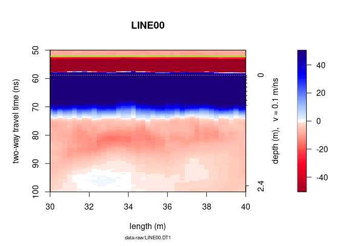
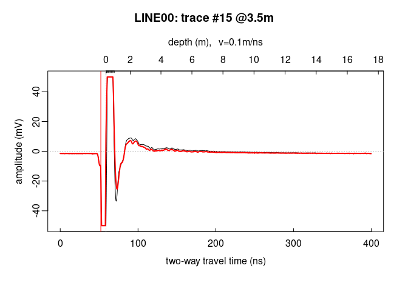

<!--
"/media/huber/Elements/UNIBAS/software/codeR/package_RGPR/RGPR-gh-pages/2014_04_25_frenke"
"G:/UNIBAS/software/codeR/package_RGPR/RGPR-gh-pages/2014_04_25_frenke"
-->

------------------------------------------------------------------------

**Note**:

-   This R-package is still in development, and therefore some of the functions may change in a near future.
-   If you have any questions, comments or suggestions, feel free to contact me (in english, french or german): <emanuel.huber@alumni.ethz.ch>.

Table of Contents
=================

-   [Objectives of this tutorial](#objectives-of-this-tutorial)
    -   [Install/load `RGPR`](#installload-rgpr)
    -   [The GPR data](#the-gpr-data)
-   [Plot the GPR data](#plot-the-gpr-data)
    -   [Two-dimensional plot: radargramm](#two-dimensional-plot-radargramm)
    -   [One-dimensional plot](#one-dimensional-plot)
        -   [Single trace plot](#single-trace-plot)
        -   [Multiple trace plot](#multiple-trace-plot)
    -   [Frequency plots](#frequency-plots)
        -   [Frequency/Phase-Amplitude (1D)](#frequencyphase-amplitude-1d)
    -   [Frequency-wavenumber filter (f-k-filter)](#frequency-wavenumber-filter-f-k-filter)
    -   [More infos](#more-infos)

Objectives of this tutorial
===========================

-   Learn how to plot GPR data.

Install/load `RGPR`
-------------------

``` r
# install "devtools" if not already done
if(!require("devtools")) install.packages("devtools")
devtools::install_github("emanuelhuber/RGPR")
```

    ## backports   (1.1.4   -> 1.1.5) [CRAN]
    ## callr       (3.3.1   -> 3.3.2) [CRAN]
    ## curl        (4.0     -> 4.2) [CRAN]
    ## digest      (0.6.20  -> 0.6.21) [CRAN]
    ## ellipsis    (0.2.0.1 -> 0.3.0) [CRAN]
    ## fields      (9.8-6   -> 9.9) [CRAN]
    ## htmltools   (0.3.6   -> 0.4.0) [CRAN]
    ## htmlwidgets (1.3     -> 1.5.1) [CRAN]
    ## httpuv      (1.5.1   -> 1.5.2) [CRAN]
    ## knitr       (1.24    -> 1.25) [CRAN]
    ## later       (0.8.0   -> 1.0.0) [CRAN]
    ## pkgconfig   (2.0.2   -> 2.0.3) [CRAN]
    ## promises    (1.0.1   -> 1.1.0) [CRAN]
    ## raster      (3.0-2   -> 3.0-7) [CRAN]
    ## rgdal       (1.4-4   -> 1.4-6) [CRAN]
    ## rgeos       (0.5-1   -> 0.5-2) [CRAN]
    ## sf          (0.7-7   -> 0.8-0) [CRAN]
    ## shiny       (1.3.2   -> 1.4.0) [CRAN]
    ## spam        (2.2-2   -> 2.3-0) [CRAN]
    ## units       (0.6-4   -> 0.6-5) [CRAN]
    ## xfun        (0.9     -> 0.10) [CRAN]
    ##
       checking for file ‘/tmp/RtmpsEzAgK/remotes43cd336a7bc9/emanuelhuber-RGPR-d06e059/DESCRIPTION’...

    ✔  checking for file ‘/tmp/RtmpsEzAgK/remotes43cd336a7bc9/emanuelhuber-RGPR-d06e059/DESCRIPTION’
    ##

    ─  preparing ‘RGPR’:
    ##

       checking DESCRIPTION meta-information...

    ✔  checking DESCRIPTION meta-information
    ##

    ─  checking for LF line-endings in source and make files and shell scripts
    ##

    ─  checking for empty or unneeded directories
    ##

    ─  looking to see if a ‘data/datalist’ file should be added
    ##

    ─  building ‘RGPR_0.0.6.tar.gz’
    ##


    ##

``` r
library(RGPR)       # load RGPR in the current R session
```

The GPR data
------------

`RPGR` comes along with a GPR data called `frenkeLine00`. Because this name is long, we set `A` equal to `frenkeLine00`:

``` r
x <- frenkeLine00
x
```

    ## *** Class GPR ***
    ##  name        = LINE00
    ##  filepath    = data-raw/LINE00.DT1
    ##  1 fiducial(s)
    ##  description =
    ##  survey date = 2014-04-25
    ##  Reflection, 100 MHz, Window length = 399.6 ns, dz = 0.4 ns
    ##  223 traces, 55.5 m
    ##  ****************

Plot the GPR data
=================

Two-dimensional plot: radargramm
--------------------------------

To plot the GPR record as a raster image (default mode), enter

``` r
plot(x)
```


The green line indicates the position of time-zero. The yellow triangle indicates the position of a fiducial marker that was set during the survey to mark something (such as a specific object close to the GPR line, a change in morphology/topography/sedimentology or an intersection with another GPR line). These markers are very useful to add topographic data to the GPR profile, particularly when the fiducial markers correspond to the locations where the (x,y,z) coordinates were measured.

Plot wiggles

``` r
plot(x, type = "wiggles")
```


To plot only a part of the GPR data, use `xlim` and `ylim`.

``` r
plot(x, ylim = c(50, 100), xlim = c(30, 40))
```



To set the origin of the vertical axis at time-zero, set the argument `relTime0` equal to `TRUE`.

``` r
plot(x, relTime0 = TRUE, ylim = c(0, 200), xlim = c(30, 50))
```


Another way to plot only a part of the GPR data is to extract a part of the GPR data. The object `A` can be manipulated in the same way as a matrix without losing the meta-data (e.g., trace coordinates, antenna separation).

To extract the samples 100 to 300 of the $15^{th}$ to $150^{th}$:

``` r
# extract the 100 to 300 samples of the traces 15 to 150
x0 <- x[100:300, 15:150]
x
```

    ## *** Class GPR ***
    ##  name        = LINE00
    ##  filepath    = data-raw/LINE00.DT1
    ##  1 fiducial(s)
    ##  description =
    ##  survey date = 2014-04-25
    ##  Reflection, 100 MHz, Window length = 399.6 ns, dz = 0.4 ns
    ##  223 traces, 55.5 m
    ##  ****************

``` r
x0
```

    ## *** Class GPR ***
    ##  name        = LINE00
    ##  filepath    = data-raw/LINE00.DT1
    ##  description =
    ##  survey date = 2014-04-25
    ##  Reflection, 100 MHz, Window length = 80 ns, dz = 0.4 ns
    ##  136 traces, 33.75 m
    ##  ****************

Check the depth/time and positions values

``` r
depth(x)
pos(x)
```

Plot a section/subset of the GPR record (like zooming)

``` r
# plot the 100 to 300 samples of the traces 15 to 150
plot(x[100:300, 15:150])
```


To not display the markers, the annotation (e.g., markers for the intersection of the GPR line with other GPR lines), the time-zero line, the colorbar (barscale), set `addFid`, `addAnn`, `addTime0` and `barscale` equal to `FALSE`.

``` r
plot(x, addFid = FALSE, addAnn = FALSE, addTime0 = FALSE, barscale = FALSE)
```


To not display the note below the x-label, the plot title (file name), the x and y lables, the colorbar label, set `note`, `main`, `ylab`, `xlab` and `clab` equal to `""`.

``` r
plot(x, note = "", main = "", ylab = "", xlab = "", clab = "")
```


One-dimensional plot
--------------------

### Single trace plot

Plot a signal trace, notice that the signal is clipped to $\pm50\,mV$ (between $0$ and $20\,ns$):

``` r
plot(x[, 15])      # plot the 15th trace of the GPR-line
```


Note: the `@3.5m` in the plot title indicate the relative position of the trace on the GPR profile.

To add another trace, use the function `lines()`

``` r
plot(x[, 15])      # plot the 15th trace of the GPR-line
lines(x[, 16], col = "red", lwd = 2)
```



Plot the first 40 trace samples:

``` r
# plot the first 40 samples of the 15th trace of the GPR profile
plot(x[1:40, 15])
```


### Multiple trace plot

Plot all the traces within a single plot:

``` r
trPlot(x, col = rgb(0.2, 0.2, 0.2, 7/100))     # plot all the traces
```


Add the average trace

``` r
trPlot(x, col = rgb(0.2, 0.2, 0.2, 7/100))     # plot all the traces
lines(traceStat(x), lwd = "2", col = "red")
```


    ## [1] 22

Frequency plots
---------------

### Frequency/Phase-Amplitude (1D)

Let's have a look at the amplitude-frequency and phase-frequency plot (the spectrum given by the Fourier decomposition):

``` r
spec(x)
```


Frequency-wavenumber filter (f-k-filter)
----------------------------------------

The function `spec()` with the argument `type = "f-k` returns a list containing the frequencies (f), the wavenumbers (k), the amplitude of the GPR data.

``` r
spec(x, type = "f-k")
```


More infos
----------

Check the help for more details on the `plot()` function:

``` r
?plot.GPR
?trPlot
```
