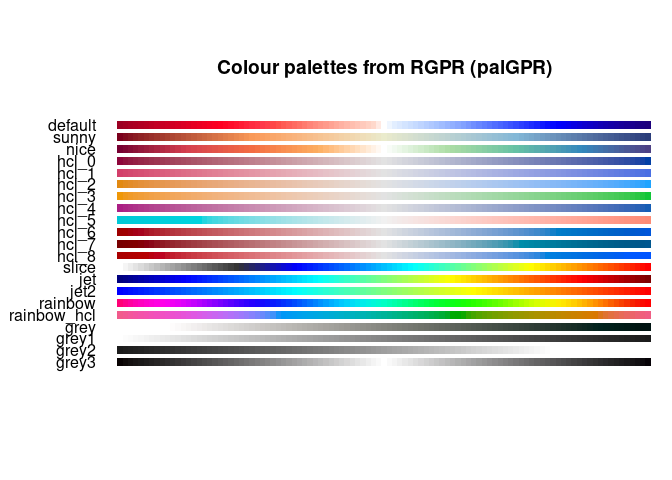
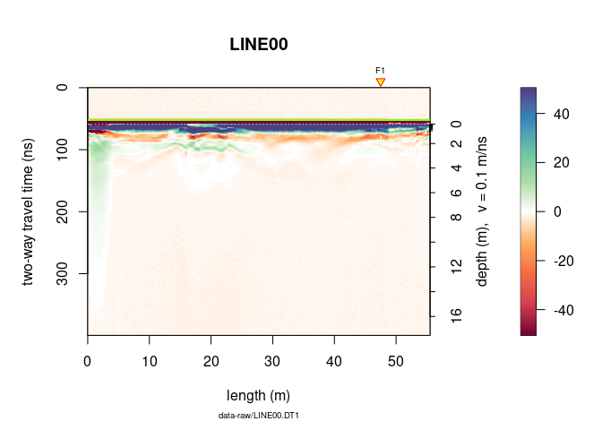
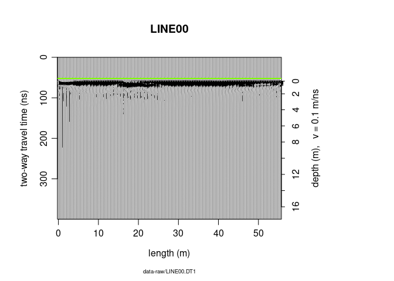
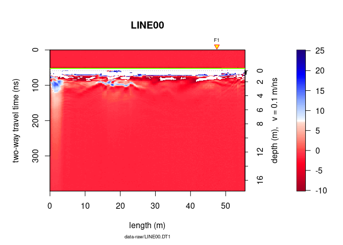
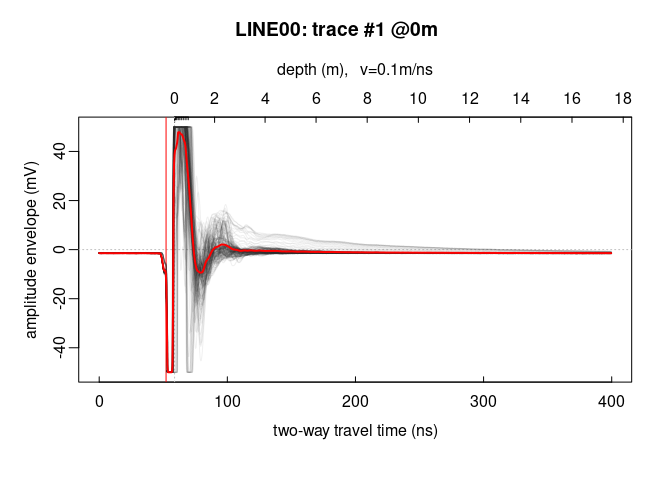

---

layout: page
title: Plot GPR data
date: 2023-09-24
---

<!--
"/media/huber/Elements/UNIBAS/software/codeR/package_RGPR/RGPR-gh-pages/2014_04_25_frenke"
"G:/UNIBAS/software/codeR/package_RGPR/RGPR-gh-pages/2014_04_25_frenke"
-->

------------------------------------------------------------------------

**Note**:

-   This R-package is still in development, and therefore some of the
    functions may change in a near future.
-   If you have any questions, comments or suggestions, feel free to
    contact me (in english, french or german):
    <a href="mailto:emanuel.huber@pm.me" class="email">emanuel.huber@pm.me</a>.

Table of Contents
=================

-   [Objectives of this tutorial](#objectives-of-this-tutorial)
    -   [Install/load `RGPR`](#installload-rgpr)
    -   [The GPR data](#the-gpr-data)
-   [Plot the GPR data](#plot-the-gpr-data)
    -   [Two-dimensional plot:
        radargramm](#two-dimensional-plot-radargramm)
        -   [Raster plot](#raster-plot)
        -   [Faster plot function](#faster-plot-function)
        -   [Wiggle plot](#wiggle-plot)
        -   [Plot settings](#plot-settings)
        -   [ggplot2\` plots](#ggplot2-plots)
        -   [Interactive plots](#interactive-plots)
        -   [Multi-plots](#multi-plots)
        -   [Annotate plots](#annotate-plots)
    -   [One-dimensional plot](#one-dimensional-plot)
        -   [Single trace plot](#single-trace-plot)
        -   [Multiple trace plot](#multiple-trace-plot)
    -   [Frequency plots](#frequency-plots)
        -   [Frequency/Phase-Amplitude
            (1D)](#frequencyphase-amplitude-1d)
    -   [Frequency-wavenumber filter
        (f-k-filter)](#frequency-wavenumber-filter-f-k-filter)
    -   [More infos](#more-infos)

Objectives of this tutorial
===========================

-   Learn how to plot GPR data.

Install/load `RGPR`
-------------------

``` r
# install "devtools" if not already done
if(!require("devtools")) install.packages("devtools")
devtools::install_github("emanuelhuber/RGPR")
```

    ## labeling    (0.4.2   -> 0.4.3) [CRAN]
    ## htmltools   (0.5.5   -> 0.5.6) [CRAN]
    ## cpp11       (0.4.5   -> 0.4.6) [CRAN]
    ## purrr       (1.0.1   -> 1.0.2) [CRAN]
    ## dplyr       (1.1.2   -> 1.1.3) [CRAN]
    ## tinytex     (0.45    -> 0.46) [CRAN]
    ## fontawesome (0.5.1   -> 0.5.2) [CRAN]
    ## bslib       (0.5.0   -> 0.5.1) [CRAN]
    ## xfun        (0.39    -> 0.40) [CRAN]
    ## rmarkdown   (2.23    -> 2.25) [CRAN]
    ## knitr       (1.43    -> 1.44) [CRAN]
    ## askpass     (1.1     -> 1.2.0) [CRAN]
    ## curl        (5.0.1   -> 5.0.2) [CRAN]
    ## gtable      (0.3.3   -> 0.3.4) [CRAN]
    ## DEoptimR    (1.1-0   -> 1.1-2) [CRAN]
    ## wk          (0.7.3   -> 0.8.0) [CRAN]
    ## promises    (1.2.0.1 -> 1.2.1) [CRAN]
    ## httr        (1.4.6   -> 1.4.7) [CRAN]
    ## ggplot2     (3.4.2   -> 3.4.3) [CRAN]
    ## units       (0.8-2   -> 0.8-4) [CRAN]
    ## classInt    (0.4-9   -> 0.4-10) [CRAN]
    ## terra       (1.7-39  -> 1.7-46) [CRAN]
    ## fields      (14.1    -> 15.2) [CRAN]
    ## adimpro     (0.9.5   -> 0.9.6) [CRAN]
    ## Cairo       (1.6-0   -> 1.6-1) [CRAN]
    ## ── R CMD build ─────────────────────────────────────────────────────────────────
    ##      checking for file ‘/tmp/RtmpzyfoS1/remotes46ab2ebd7edb/emanuelhuber-RGPR-0ba96b9/DESCRIPTION’...  ✔  checking for file ‘/tmp/RtmpzyfoS1/remotes46ab2ebd7edb/emanuelhuber-RGPR-0ba96b9/DESCRIPTION’
    ##   ─  preparing ‘RGPR’:
    ## ✔  checking DESCRIPTION meta-information
    ##   ─  checking for LF line-endings in source and make files and shell scripts
    ##   ─  checking for empty or unneeded directories
    ##        NB: this package now depends on R (>= 3.5.0)
    ##        WARNING: Added dependency on R >= 3.5.0 because serialized objects in
    ##      serialize/load version 3 cannot be read in older versions of R.
    ##      File(s) containing such objects:
    ##        ‘RGPR/test.rds’
    ##   ─  building ‘RGPR_0.0.7.tar.gz’
    ##
    ##

``` r
library(RGPR)       # load RGPR in the current R session
```

The GPR data
------------

`RPGR` comes along with a GPR data called `frenkeLine00`. Because this
name is long, we set `A` equal to `frenkeLine00`:

``` r
x <- frenkeLine00
x
```

    ## *** Class GPR ***
    ##  name        = LINE00
    ##  filepath    = data-raw/LINE00.DT1
    ##  1 fiducial(s)
    ##  description =
    ##  survey date = 2014-04-25
    ##  Reflection, 100 MHz, Window length = 399.6 ns, dz = 0.4 ns
    ##  223 traces, 55.5 m
    ##  ****************

Plot the GPR data
=================

Two-dimensional plot: radargramm
--------------------------------

### Raster plot

To plot the GPR record as a raster image (default mode), enter

``` r
plot(x)
```


The green line indicates the position of time-zero. The yellow triangle
indicates the position of a fiducial marker that was set during the
survey to mark something (such as a specific object close to the GPR
line, a change in morphology/topography/sedimentology or an intersection
with another GPR line). These markers are very useful to add topographic
data to the GPR profile, particularly when the fiducial markers
correspond to the locations where the (x,y,z) coordinates were measured.

Do you want another color palette? RGPR comes with predefined color
palettes. Check them with:

``` r
displayPalGPR()
```



Plot a single palette:

``` r
plotPal(palGPR("nice"))
```


Choose the color palette you want and plot the GPR data with it:

``` r
plot(x, col = palGPR("nice"))
```



You can reduce the number of colors with:

``` r
plot(x, col = palGPR("nice", n = 5))
```


### Faster plot function

Instead of `plot(x)` use `plotFast(x)`!

### Wiggle plot

Plot wiggles

``` r
plot(x, type = "wiggles")
```



### Plot settings

#### Set x and y limits

To plot only a part of the GPR data, use `xlim` and `ylim`.

``` r
plot(x, ylim = c(50, 100), xlim = c(30, 40))
```


Another way to plot only a part of the GPR data is to extract a part of
the GPR data. The object `A` can be manipulated in the same way as a
matrix without losing the meta-data (e.g., trace coordinates, antenna
separation).

To plot only the samples 100 to 300 of the $15^{th}$ to $150^{th}$
:

``` r
# plot the 100 to 300 samples of the traces 15 to 150
plot(x[100:300, 15:150])
```


#### Change the scale of the colorbar

To change the span of the colorbar from -10 to 25 do

``` r
plot(x, zlim = c(-10, 25))
```



#### Display GPR data relative to time-zero

To set the origin of the vertical axis at time-zero, set the argument
`relTime0` equal to `TRUE`.

``` r
plot(x, relTime0 = TRUE, ylim = c(0, 200), xlim = c(30, 50))
```


#### Markers, annotations, note…

To not display the markers, the annotation (e.g., markers for the
intersection of the GPR line with other GPR lines), the time-zero line,
the colorbar (barscale), set `addFid`, `addAnn`, `addTime0` and
`barscale` equal to `FALSE`.

``` r
plot(x, addFid = FALSE, addAnn = FALSE, addTime0 = FALSE, barscale = FALSE)
```


To not display the note below the x-label, the plot title (file name),
the x and y lables, the colorbar label, set `note`, `main`, `ylab`,
`xlab` and `clab` equal to `""`.

``` r
plot(x, note = "", main = "", ylab = "", xlab = "", clab = "")
```


### `ggplot2` plots

Plots with `ggplot2`, a R-package based on the Grammar of Graphics.

``` r
x <-frenkeLine00

ggplotGPR(x)
```


The `ggplotGPR()` function is a wrapper for:

``` r
col <- palGPR()
x <- frenkeLine00

Xm <- data.frame(x = rep(pos(x), nrow(x)),
                 y = rep(depth(x), each = ncol(x)),
                 value =  as.vector(t(as.matrix(x)[nrow(x):1, ])))
ggplot2::ggplot(Xm) +
  ggplot2::geom_tile(ggplot2::aes(x = x, y = y, fill = value)) +
  ggplot2::scale_x_continuous("X", expand = c(0, 0)) +
  ggplot2::scale_y_continuous("Y", expand = c(0, 0)) +
  ggplot2::scale_fill_gradientn("Z", colours = col)
```

### Interactive plots

Use the function `plotly()` to produce interactive plots powered powered
by the JavaScript library plotly.js. The function `plotly()` works only
with 2D data.

``` r
x <- frenkeLine00

plotly(x)
```


### Multi-plots

Use `par(mfrow = c(nr, nc))`, where `ncr` is the number of rows and `nc`
is the number of column. Example:

``` r
x <- frenkeLine00

par(mfrow = c(2,2), oma = c(0, 0, 0, 0))
plot(x)
plot(x, col = palGPR("nice"))
plot(x, col = palGPR("sunny"))
plot(x, col = palGPR("hcl_0"))
```


### Annotate plots

Here an example on how to annotate plots:

``` r
x <- frenkeLine00

plot(x)
rect(xleft = 35,
     ybottom = 120,
     xright = 45,
     ytop = 50,
     border = "firebrick",
     lty = 3,   # line style: 1 = continuous line
     lwd = 2)   # width
# text annotation
text(45, 50, "A20-21Z", adj = c(0, 0))
#grid
grid(col = "red")
# point
points(50, 300, pch = 21, col = "red", lwd = 2)
# horizontal and vertical linges
abline(h = 300, v = 30, col = "black", lty = 2, lwd = 3)

# For circles, squares and stars the units of the x axis are used
# circles
symbols(30, 300, circles = 10,
        add = TRUE, lwd = 2, fg = "dodgerblue", inches = FALSE, lty = 1)
# rectangles
symbols(5, 200, rectangles = matrix(c(5, 200), nrow = 1, ncol = 2),
        add = TRUE, lwd = 3, fg = "dodgerblue", inches = FALSE, lty = 3)
# stars
symbols(20, 150, stars = matrix(c(0.35, 1, 0.35, 1,  0.35, 1,  0.35, 1, 0.35, 1), nrow = 1),
        add = TRUE, lwd = 1, bg = "goldenrod1", fg = "black", inches = FALSE, lty = 1)
```


One-dimensional plot
--------------------

### Single trace plot

Plot a signal trace, notice that the signal is clipped to $\pm50\,mV$ (between $0$ and $20\,ns$
):

``` r
plot(x[, 15])      # plot the 15th trace of the GPR-line
```


Note: the `@3.5m` in the plot title indicate the relative position of
the trace on the GPR profile.

To add another trace, use the function `lines()`

``` r
plot(x[, 15])      # plot the 15th trace of the GPR-line
lines(x[, 16], col = "red", lwd = 2)
```


Plot the first 40 trace samples:

``` r
# plot the first 40 samples of the 15th trace of the GPR profile
plot(x[1:40, 15])
```


### Multiple trace plot

Plot all the traces within a single plot:

``` r
trPlot(x, col = rgb(0.2, 0.2, 0.2, 7/100))     # plot all the traces
```


Add the average trace

``` r
trPlot(x, col = rgb(0.2, 0.2, 0.2, 7/100))     # plot all the traces
lines(traceStat(x), lwd = "2", col = "red")
```



Frequency plots
---------------

### Frequency/Phase-Amplitude (1D)

Let’s have a look at the amplitude-frequency and phase-frequency plot
(the spectrum given by the Fourier decomposition):

``` r
spec(x)
```


Frequency-wavenumber filter (f-k-filter)
----------------------------------------

The function `spec()` with the argument `type = "f-k` returns a list
containing the frequencies (f), the wavenumbers (k), the amplitude of
the GPR data.

``` r
spec(x, type = "f-k")
```


More infos
----------

Check the help for more details on the `plot()` function:

``` r
?plot.GPR
?trPlot
```
