<!--
"/media/huber/Elements/UNIBAS/software/codeR/package_RGPR/RGPR-gh-pages/2014_04_25_frenke"
"G:/UNIBAS/software/codeR/package_RGPR/RGPR-gh-pages/2014_04_25_frenke"
-->

------------------------------------------------------------------------

**Note**:

-   This R-package is still in development, and therefore some of the functions may change in a near future.
-   If you have any questions, comments or suggestions, feel free to contact me (in english, french or german): <emanuel.huber@alumni.ethz.ch>.

Objectives of this tutorial
===========================

-   Learn some basics of ground-penetrating radar data processing with `RGPR`.
-   Learn how to manipulate objects of the class `RGPR`.

Note that his tutorial will not explain you the math/algorithms behind the different processing methods.

Preliminary
===========

-   Download the data [2014\_04\_25\_frenke.zip](http://emanuelhuber.github.io/RGPR/2014_04_25_frenke.zip)
-   Unzip the data

File organisation
-----------------

I suggest to organise your files and directories as follows:

    /2014_04_25_frenke   (project directory with date and location)
        /processing      (here you will save the processed GPR files)
        /rawGPR          (the raw GPR data, never modify them!)
        RGPR_tutorial.R  (this is you R script for this tutorial)

Install/load `RGPR` and set the working directory
-------------------------------------------------

-   Install and load the `RGPR`-package

    ``` r
    # install "devtools" if not already done
    if(!require("devtools")) install.packages("devtools")
    devtools::install_github("emanuelhuber/RGPR")
    library(RGPR)       # load RGPR in the current R session
    ```

-   Set the working directory:

    ``` r
    myDir <- "~/2014_04_25_frenke"  # adapt that to your directory structure
    setwd(myDir)    # set the working directory
    getwd()         # Return the current working directory (just to check)
    ```

Read GPR data
=============

The raw GPR data are located in the directory `/rawGPR`. The data format is the Sensors & Software format. Each GPR data consists of

-   a header file (extension `.hd`) that can be opened with a normal text editor
-   a binary data file (extension `.DT1`).

To read the GPR data, enter

``` r
A <- readGPR(dsn = "rawGPR/LINE00.DT1")   # the filepath is case sensitive!
class(A)
```

    ## [1] "GPR"
    ## attr(,"package")
    ## [1] "RGPR"

Basic processing steps
======================

First wave break and time zero estimation
-----------------------------------------

Here, we define time-zero, $t_0$ as the time at which the transmitter starts to emit the wave.

Maybe is time zero not correctly set. To get the time-zero for each traces of `A` use the function `time0()`:

``` r
time0(A)
```

The first wave break, $t_{\mathrm{fb}}$, is estimated for each traces (it is the time of the first wave record) with `firstBreak()`:

``` r
tfb <- firstBreak(A, w = 20, method = "coppens", thr = 0.05) # take some time
plot(pos(A), tfb, pch = 20, ylab = "first wave break",
     xlab = "position (m)")
```


Convert the first wave break time $t_{\mathrm{fb}}$ into time-zero $t_0$ with `firstBreakToTime0()`.

Here we define

$$
t_0 = t_{\mathrm{fb}} - a/c_0
$$

where $a$ is the distance between the transmitter and receiver and $c_0$ is the wave velocity in the media between the transmitter and receiver (in our case, air). The value $a/c_0$ corresponds to the wave travel time from the transmitter to the receiver.

``` r
t0 <- firstBreakToTime0(tfb, A)
time0(A) <- t0     # set time0 to A
```

Note that if `t0` is too noisy, you can set `time0(A) <- mean(t0)`.

Check the results (do you see the difference between time zero in red and first wave break time in blue?):

``` r
plot(A[, 15], xlim = c(0, 100))  # plot the 15th trace of the GPR-line
abline(v = tfb[15], col = "blue")  # first wave break time
```


Time zero correction
--------------------

To shift the traces to time-zero, use the function `time0Cor` (the `method` argument defines the type of interpolation method)

``` r
A1 <- time0Cor(A, method = "pchip")
```

``` r
plot(A1)
```

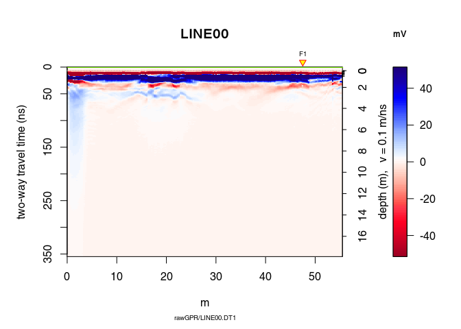

Have a look at A1:

``` r
A1
```

    ## *** Class GPR ***
    ##  name        = LINE00
    ##  filepath    = rawGPR/LINE00.DT1
    ##  1 fiducial(s)
    ##  description =
    ##  survey date = 2014-04-25
    ##  Reflection, 100 MHz, Window length = 354.8 ns, dz = 0.4 ns
    ##  223 traces, 55.5 m
    ##  > PROCESSING
    ##    1. time0<-
    ##  ****************

Compared with `A` or `print(A)`, three additional lines are displayed. The two last line show the applied processing step:

-   set time zero with `time0<-`
-   time zero correction with `time0Cor`. The arguments passed to the function are listed after the double slashes `//`

Each time a GPR object is processed with a function, the name of the function as well as some of its arguments are stored in the GPR object. This enables to track the data processing, i.e., to know exactly which processing steps where applied to the data. This is a first step toward reproducible research.

The processing steps can be extracted with the function `processing()`:

``` r
proc(A1)
```

    ## [1] "time0<-"

DC shift removal
----------------

Plot a single trace:

``` r
plot(A1[, 15])  # plot the 15th trace of the GPR-line
```

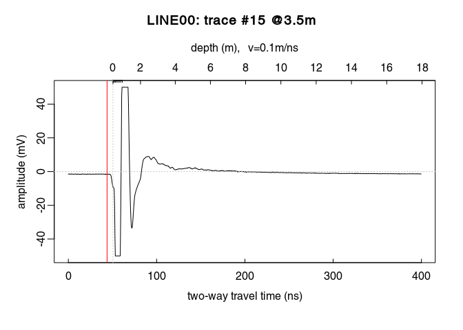

Notice how the trace samples before the first wave arrival (before $t = 0\,ns$) are slightly shifted below $0\,mV$? This shift is called direct current offset (DC-offset) and you will remove it from the data. The direct current offset is estimated on trace samples before time-zero.

1.  Determine which samples will be used to estimate the direct current offset (i.e., the samples before the first wave arrival). Identify the samples before $t = 0\,ns$     by ploting the first $n$     samples of the traces. For example, for $n = 110$:

    ``` r
    # plot the first 110 samples of the 15th trace of the GPR profile
    plot(A1[1:110, 15])
    ```

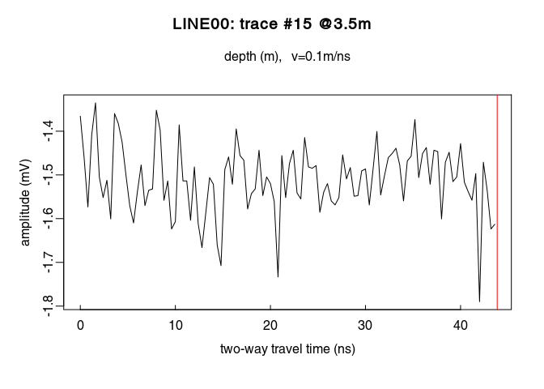

    You can visualise the DC-offset on the trace plot by adding an horizontal lines (`abline(h=...)`) with the argument `h` equal the DC-offset, i.e., the mean of the first $110$     samples (`mean(A[1:110,15]`):

    ``` r
    plot(A1[, 15])  # plot the 15th trace of the GPR-line
    # add a green horizontal line
    abline(h = mean(A1[1:110, 15]), col = "green")
    ```

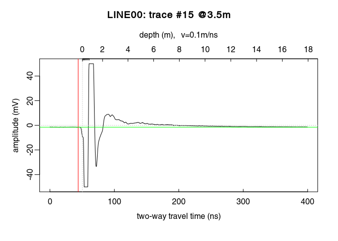

2.  Remove the DC-offset estimated on the first n samples usind the function `dcshift()`. This function takes as argument the `GPR` object and the sample index used to estimate the DC shift (in this case, the first $110$     samples):

    ``` r
    A2 <- dcshift(A1, 1:110)   # new object A2
    ```

Dewow
-----

Remove the low-frequency components (the so-called "wow") of the GPR record using:

1.  either a median absolute deviation (MAD) filter (`type = "MAD"`).
2.  or a Gaussian filter (`type = "Gaussian"`). The Gaussian filter is faster than the MAD filter.

In both cases, the argument `w` is the length of the filter in time units.

``` r
A3 <- dewow(A2, type = "MAD", w = 50)     # dewowing: take some time
plot(A3)                                  # plot the result
```

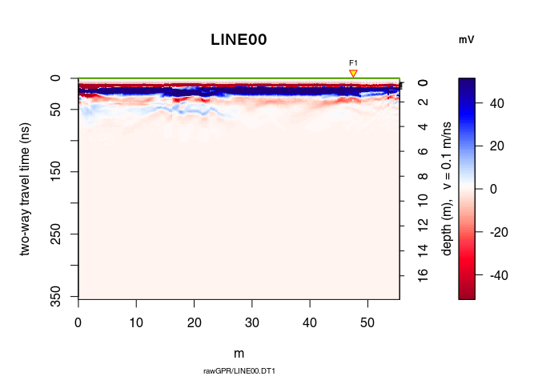

Can you see the difference with `A1`? Plot `A2 - A1` to see the removed "wow".

``` r
plot(A3 - A2)                           # plot the difference
```

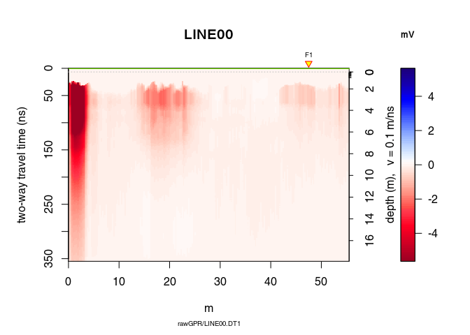

See the dewowing by comparing the traces before (blue line) and after (red line):

``` r
plot(A2[,15], col = "blue")      # before dewowing
lines(A3[,15], col = "red")      # after dewowing
```

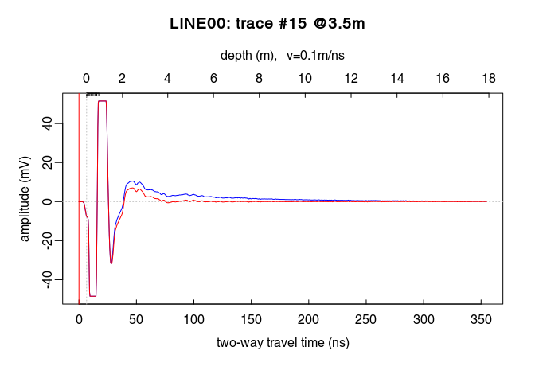

Frequency filter
----------------

Let's have a look at the amplitude-frequency and phase-frequency plot (the spectrum given by the Fourier decomposition):

``` r
spec(A3)
```

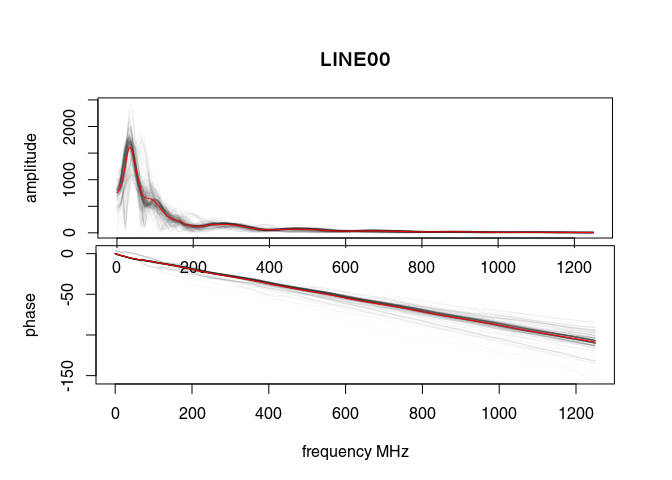

The curve in red is the averaged amplitude/phase over all the trace amplitudes/phases.

On the first plot, notice

-   a sharp increase of the amplitude between $0\,\mathit{MHz}$     and $10\,\mathit{MHz}$: these frequency correspond to the slowing-varying part of the signal. In this particular case, filtering out this part of the signal results in strong signal distorsion.
-   after a peak at $80\,\mathit{MHz}$     (the returned signal frequency that is lower than the antenna frequency because of frequency-dependent attenuation in the ground), the amplitude decreases.
-   at about $200\,\mathit{MHz}$     the amplitude stays constant (plateau): noise frequency.

Eliminate the high-frequency (noise) component of the GPR record with a bandpass filter. We define as corner frequencies at $150\,\mathit{MHz}$ and $260\,\mathit{MHz}$, and set `plotSpec = TRUE` to plot the spectrum with the signal, the filtered signal and the filter.

``` r
A4 <- fFilter(A3, f = c(150, 260), type = "low", plotSpec = TRUE)
```

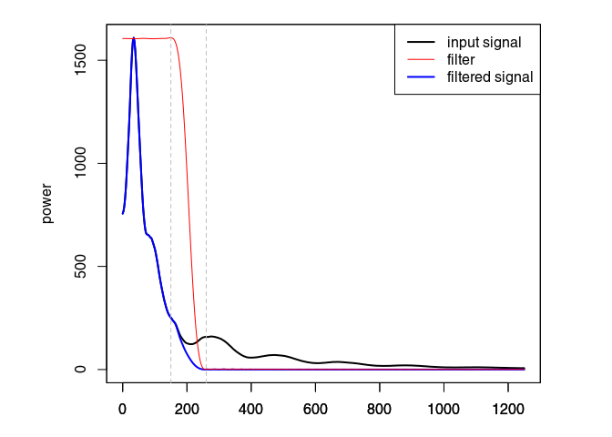

``` r
plot(A4)
```


Let see the difference

``` r
plot(A4 - A3, clip = 50)
```

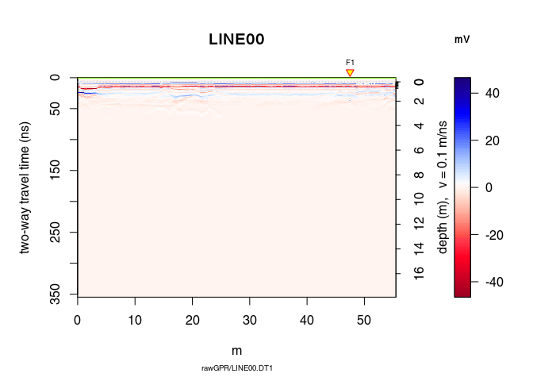

Ideally, the objective of processing is to remove the noise component without altering the signal component to improve the signal/noise ratio. When ploting the difference in processing (after - before), one should only observe the noise that is filtered out. Here, removing and attenuating some frequencies change the signal amplitude.

Amplitude gain
--------------

Apply a gain to compensate the signal attenuation. Three types of gain are available:

-   power gain (`type = "power"`):

    $$
    A_g(t) = A(t)\cdot t^\alpha
    $$

    with $\alpha = 1$     per default.

-   exponential gain (`type = "exp"`):

    $$
    A_g(t) = A(t)\cdot\exp(\alpha\cdot t)
    $$

-   Automatic gain control (`type = "agc"`): make gain equal to the local root mean squared signal.

We will first apply a power gain and then an exponential gain. To visualise the amplitude of the GPR signal as a function of time, use the function `plotAmpl()` as follows:

``` r
plotAmpl(A4, col = "black")          # plot amplitude as a function of time
```

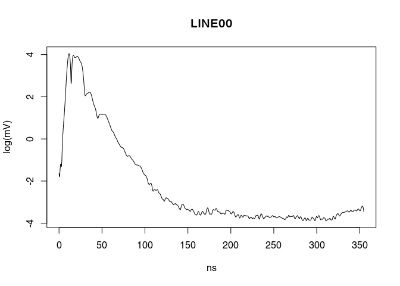

On the previous plot, there is a sharp amplitude increase at about $20\,ns$ corresponding to the first wave arrival. Then the amplitude decreases until a plateau at about $200\,\mathit{ns}$. This plateau corresponds to the signal noise. There is little hope to extract some useful information above 150 ns because above $150\,ns$ the signal/noise ratio is much smaller than $1$ (i.e., more noise than signal).

### Power gain

The power gain is set constant until `tcst = 100` ns and applied from $100\,ns$ to `te = 200` ns, with $\alpha = 1$.

``` r
A5 <- gain(A4, type = "power", alpha = 1, te = 150, tcst = 20)
```

Compare the amplitude before and after the power gain:

``` r
plotAmpl(A4, col = "black")
# set add=TRUE to add the amplitude on the previous plot
plotAmpl(A5, col = "red", add = TRUE)
```

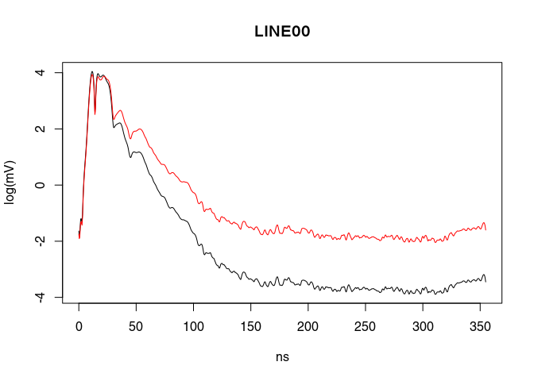

``` r
plot(A5)      # how does it look after the gain?
```

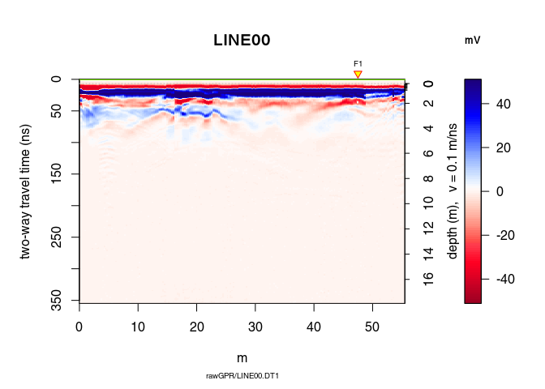

### Exponential gain

Ideally, the parameter $\alpha$ in the exponential gain should be close to the slope of the amplitude decrease. This slope could be estimated by fitting a straight line to the amplitude decrease. We only want to apply the filter between $0\,\mathit{ns}$ (`t0`) and $125\,\mathit{ns}$ (`te` for $t_\mathit{end}$):

``` r
A6 <- gain(A5, type ="exp",  alpha = 0.2, t0 = 0, te = 125)
plotAmpl(A6, col = "green")
```

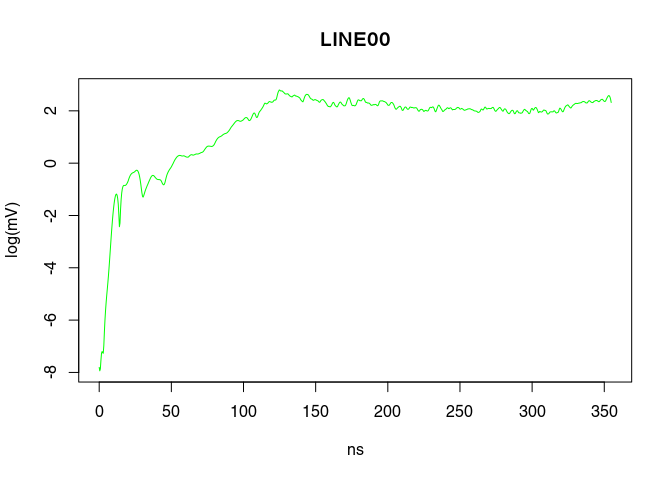

Oops! Set `alpha` to a smaller value!

``` r
A6 <- gain(A5, type = "exp", alpha = 0.11, t0 = 0, te = 125)
plotAmpl(A4, col = "black")
plotAmpl(A5, col = "red", add = TRUE)
plotAmpl(A6, col = "green", add = TRUE)
```

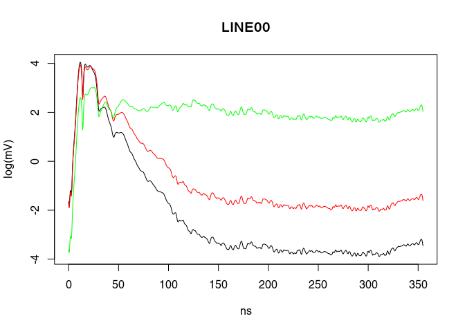

``` r
plot(A6)    # how does it look after the gain?
```


Plot the gained GPR record and clip the amplitude values to $50\,\mathit{mV}$ using the argument `clip`:

``` r
plot(A6, clip = 50)    # how does it look after the gain?
```

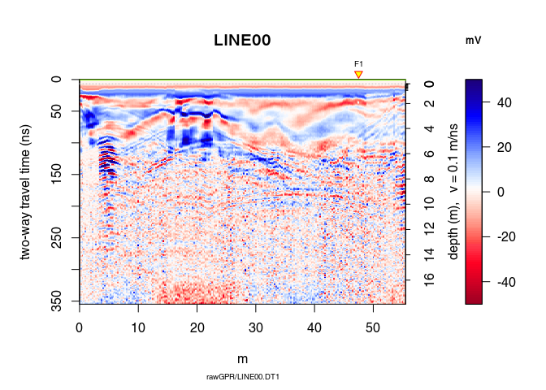

inverse normal transformations
------------------------------

Have a look at the histogram of the values of `A6`

``` r
hist(A6[], breaks = 50)
```

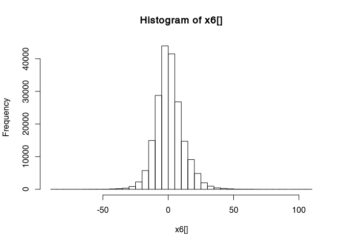

This histogram is very narrow, meaning that a lot of values are very close to zero and therefore many details are not really visible. To widen this histogram, we can transform it to make it more normally distributed with a rank-based inverse normal transformation:

``` r
A7 <- traceScaling(A6, type = "invNormal")
```

Histograms before and after

``` r
par(mfrow = c(1, 2))
hist(A6[], breaks = 50)
hist(A7[], breaks = 50)
```

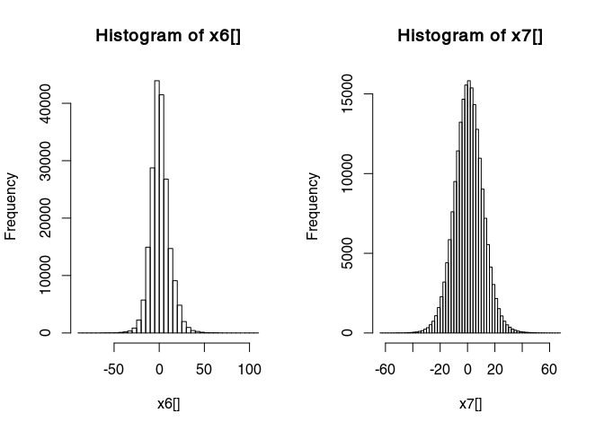 Have a look at the results of the transformation:

``` r
plot(A7)
```

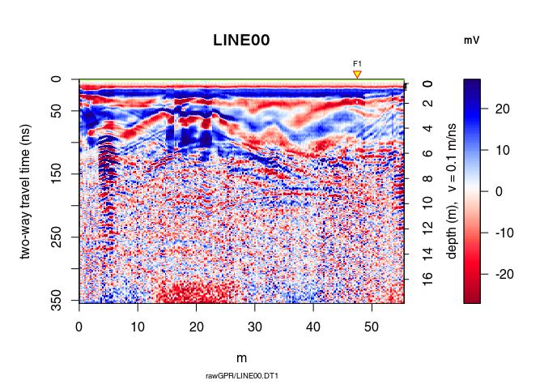

Median filter (spatial filter)
------------------------------

A non-linear filter to remove noise:

``` r
A8 <- filter2D(A7, type = "median3x3")
plot(A8)
```

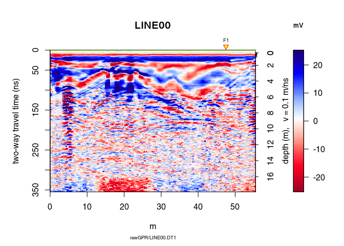

Let see the difference

``` r
plot(A8 - A7)
```

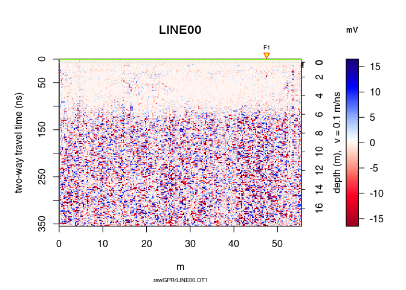

Frequency-wavenumber filter (f-k-filter)
----------------------------------------

The function `spec()` with the argument `type = "f-k` returns a list containing the frequencies (f), the wavenumbers (k), the amplitude of the GPR data.

``` r
FKSpec <- spec(A8, type = "f-k")
area <- list(x = c(0, min(FKSpec$wnb), min(FKSpec$wnb), max(FKSpec$wnb), max(FKSpec$wnb), 0),
             y = c(max(FKSpec$fre), 800, 0, 0, 800, max(FKSpec$fre)))
lines(area, type="o")
```


``` r
A9 <- fkFilter(A8, fk = area)
```

With the f-k-filter you can successfully remove the artifacts but still the information gained is very small in this case (the quality of the raw GPR data is already bad):

``` r
plot(A9, clip = 50)
```

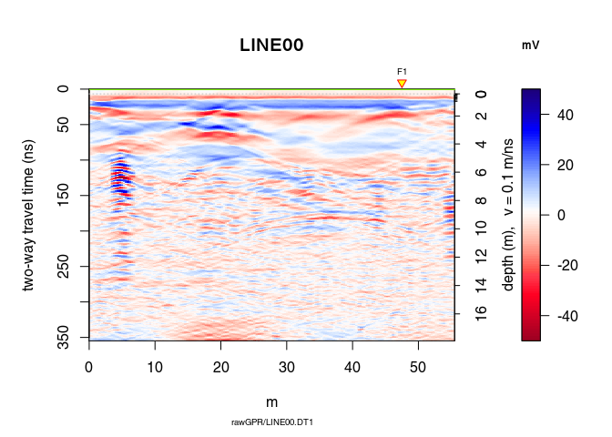

``` r
spec(A9, type = "f-k")
```

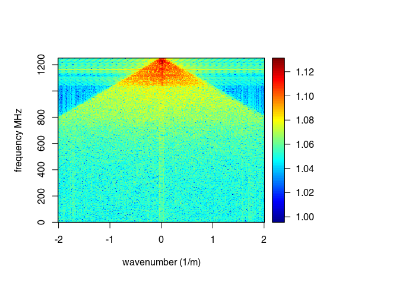

Let see the difference

``` r
plot(A9 - A8)
```

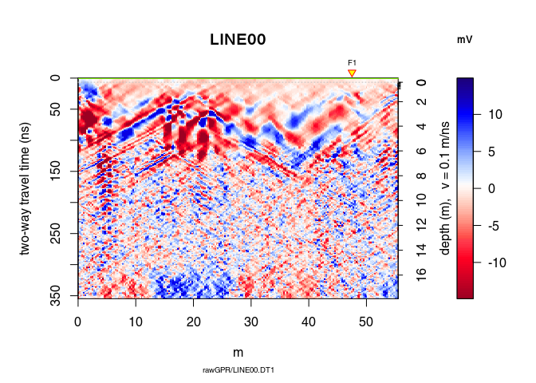

Processing overview
-------------------

Let review the processing step applied on the GPR record:

``` r
proc(A9)
```

Other processing functions
--------------------------

### Trace average removal

Check the help page for the function `traceAverage`

``` r
?traceAverage
```

``` r
A10 <- traceAverage(A9, FUN = mean)  # compute average trace of all traces
A10 <- traceAverage(A9, FUN = median)  # compute average trace of all traces
A10 <- traceAverage(A9, FUN = median)  # compute average trace of all traces
# compute windowed average trace (average of 20 traces)
A10 <- traceAverage(A9, w = 20, FUN = median)
```

### Eigen Image Filter

``` r
?eigenFilter

# remove first eigenimage = keep all except the first one
plot(eigenFilter(A9, eigenvalue = c(2:ncol(x1))))
plot(eigenFilter(A9, eigenvalue = 1)) # the removed eigenvalue

# remove the first two eigenimages
plot(eigenFilter(A9, eigenvalue = c(3:ncol(x1))))
plot(eigenFilter(A9, eigenvalue = 1:2)) # the removed eigenvalue
```

### Background matrix substraction

See See Rashed and Harbi (2014) Background matrix subtraction (BMS): A novel background removal algorithm for GPR data doi: [10.1016/j.jappgeo.2014.04.022](https://doi.org/10.1016/j.jappgeo.2014.04.022)

It is a **slow** function!

``` r
?backgroundSub

A10 <- backgroundSub(A9, width = 21, trim = 0.2, s = 1, eps = 1, itmax = 5)
plot(A10)
plot(A10 - A9)
```

Save and export
---------------

Save the processed GPR record into the directory /processing. Use the `.rds` format (this is a R internal format)

``` r
writeGPR(A9, fPath = file.path(getwd(), "processing", paste0(name(A9), ".rds")),
         format = "rds", overwrite = TRUE)
```

    ## *** Class GPR ***
    ##  name        = LINE00
    ##  filepath    = /media/huber/Seagate1TB/UNIBAS/PROJECTS/RGPR/CODE/RGPR-gh-pages/2014_04_25_frenke/processing/LINE00.dt1
    ##  1 fiducial(s)
    ##  description =
    ##  survey date = 2014-04-25
    ##  Reflection, 100 MHz, Window length = 354.8 ns, dz = 0.4 ns
    ##  223 traces, 55.5 m
    ##  > PROCESSING
    ##    1. time0<-
    ##  ****************

Export a high quality PDF:

``` r
plot(A9, type = "wiggles", clip = 30, pdfName = file.path(getwd(), "processing", name(A9)),
          lwd = 0.5, wsize = 2.5)
```

Read the saved GPR data
-----------------------

``` r
procA <- readGPR(fPath = file.path(getwd(), "processing", paste0(name(A9), ".rds")))
```

Some final thoughts
===================

Warning: processing can introduce artifacts in the data and lead to wrong interpretations.

------------------------------------------------------------------------

> What really matters is that the final interpretation is valid, and although processing is important, ultimately, the key to good data interpretation is good data collection in the first place.
> *in Cassidy (2009) Chapter 5 - Ground Penetrating Radar Data Processing, Modelling and Analysis, In Ground Penetrating Radar Theory and Applications, (Eds Harry M. Jol,), Elsevier, Amsterdam, pp: 141-176, ISBN 9780444533487*.

------------------------------------------------------------------------

> A good practical mantra for most users to adopt is if it cannot be seen in the raw data – is it really there? As such, processing steps should be used to improve the raw-data quality, therefore, making interpretation easier. In practice, this means increasing the signal-to-noise ratio of coherent responses and presenting the data in a format that reflects the subsurface conditions accurately.
> *in Cassidy (2009) Chapter 5 - Ground Penetrating Radar Data Processing, Modelling and Analysis, In Ground Penetrating Radar Theory and Applications, (Eds Harry M. Jol,), Elsevier, Amsterdam, pp: 141-176, ISBN 9780444533487*.

------------------------------------------------------------------------

> Processing of GPR data tends to improve the appearance of data, but rarely does processing substantially change the interpretation.
> *in Daniels et al. (1997) Coincident Antenna Three-Dimensional GPR. Journal of Environmental and Engineering Geophysics, Vol. 2, No.1, pp. 1–9*.
