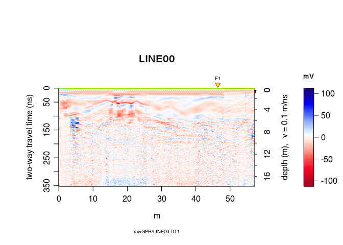
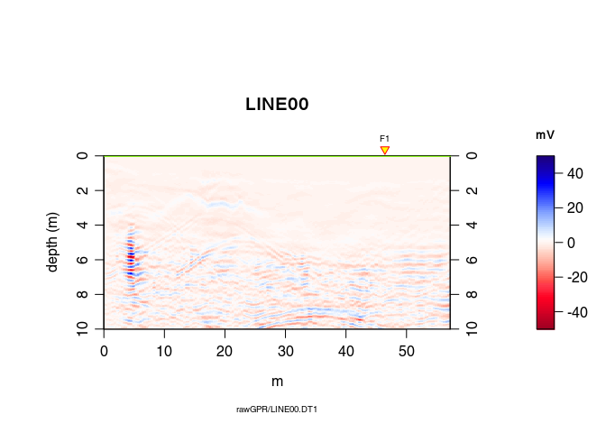
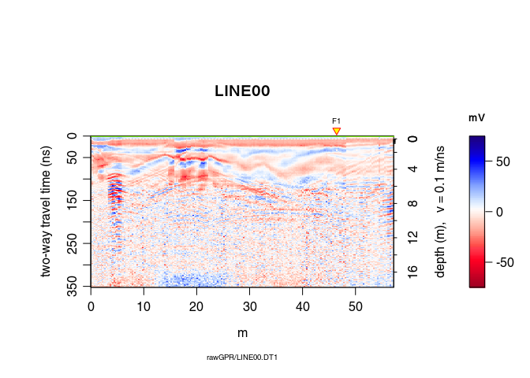

---
layout: page
title: GPR data migration
date: 2018-05-09
--- 

***

**Note**: 

* This R-package is still in development, and therefore some of the functions may change in a near future. 
* If you have any questions, comments or suggestions, feel free to contact me (in english, french or german): <emanuel.huber@alumni.ethz.ch>.


# Objectives of this tutorial
**Learn how to migrate GPR data.**

Note that his tutorial will not explain you the math/algorithms behind the different processing methods.


# Preliminary

* Download the data [2014_04_25_frenke.zip](http://emanuelhuber.github.io/RGPR/2014_04_25_frenke.zip)
* Unzip the data

## File organisation
I suggest to organise your files and directories as follows:
```
/2014_04_25_frenke   (project directory with date and location)
    /processing      (here you will save the processed GPR files)
    /rawGPR          (the raw GPR data, never modify them!)
    RGPR_tutorial.R  (this is you R script for this tutorial)
```


## Install/load `RGPR` and set the working directory

* Install and load the `RGPR`-package
    
    ```r
    # install "devtools" if not already done
    if(!require("devtools")) install.packages("devtools")
    devtools::install_github("emanuelhuber/RGPR")
    library(RGPR)       # load RGPR in the current R session
    ```
    
* Set the working directory:
    
    ```r
    myDir <- "~/2014_04_25_frenke"  # adapt that to your directory structure
    setwd(myDir)    # set the working directory
    getwd()         # Return the current working directory (just to check)
    ```


# Read GPR data


```r
A <- readGPR(fPath = "rawGPR/LINE00.DT1")   # the filepath is case sensitive!
```


# Pre-processing

## Add topographic data (coordinates)
We assume that for each GPR record there is a file containing the (x, y, z) 
coordinates of every traces. The header of these files is "E", "N", "Z" 
instead of "x", "y", "z" because in topography "x" sometimes designates the 
North ("N") and not the East ("E") as we would expect. The designation
"E", "N", "Z" is less prone to confusion and therefore we chose it!

1. Define the filepaths to the topo files:

```r
TOPO <- file.path(getwd(), "coord/topo/LINE00.txt")
```

2. Read all the files with the funciton `readTopo()` that creates a list whose 
elements correspond to the GPR record and contain all the trace coordinates:

```r
TOPOList <- readTopo(TOPO, sep = "\t")
```

3. Set the list of coordinates as the new coordinates to the GPRsurvey object:

```r
coord(A) <- TOPOList[[1]]
```


## DC shift removal
Remove the DC-offset estimated on the first n samples usind the function 
`dcshift()`. This function takes as argument the `GPR` object and the sample 
index used to estimate the DC shift (in this case, the first \(110\) samples):

```r
A1 <- dcshift(A, 1:110)   # new object A1 
```


## First wave break estimation and set time-zero

The first wave break time, t_{\mathrm{fb}}, is estimated for each traces

```r
tfb <- firstBreak(A1)   # take some time
```

Convert the first wave break time \(t_{\mathrm{fb}}\) into time-zero \(t_0\) 
with `firstBreakToTime0()`. 

Here we define \(t_0 = t_{\mathrm{fb}} - a/c_0\), where \(a\) is the distance
between the transmitter and receiver and \(c_0\) is the wave velocity in
the media between the transmitter and receiver (in our case, air). 
The value \(a/c_0\) corresponds to the wave travel time from the transmitter 
to the receiver.


```r
t0 <- firstBreakToTime0(tfb, A1)
time0(A1) <- t0     # set time0 to A1
```

To shift the traces to time-zero, use the function `time0Cor`.


```r
A2 <- time0Cor(A1, method = "spline")
```


## Dewow
Remove the low-frequency components (the so-called "wow") of the GPR record 
with:


```r
A3 <- dewow(A2, type = "MAD", w = 50)     # dewowing: take some time
```

## Frequency filter

Eliminate the high-frequency (noise) component of 
the GPR record with a bandpass filter. We define as corner frequencies 
at \(150\,MHz\) and \(260\,MHz\), and set 
`plotSpec = TRUE` to plot the spectrum with the signal, the filtered signal and 
the filter.


```r
A4 <- fFilter(A3, f = c(150, 260), type = "low", plotSpec = TRUE)
```


## Time gain
Apply a power gain and a spherical gain to compensate for geometric wave 
spreading and attenuation (Kruse and Jol, 2003; Grimm et al., 2006).


```r
A5 <- gain(A4, type = "power", alpha = 1, te = 150, tcst = 20)
A6 <- gain(A5, type = "exp", alpha = 0.11, t0 = 0, te = 125)
```


# Topographic Kirchhoff migration
See *Dujardin & Bano (2013, Topographic migration of GPR data: 
Examples from Chad and Mongolia, Comptes Rendus Géoscience, 345(2):73-80.
Doi : 10.1016/j.crte.2013.01.003)*

## Pre-processing

### Constant offset correction
Time correction for each trace to compensate the offset between transmitter 
and receiver antennae (it converts the trace time of the data acquired with
a bistatic antenna system into trace time data virtually acquiered with 
a monostatic system)


```r
A7 <- timeCorOffset(A6)
```

```
## Warning in time0Cor(x, method = "spline"): Nothing shifted because all 't0'
## or 'time0(x)' values as well as all 'keep' values are equal to zero!
```

```r
plot(A7)
```



### Time upsampling (sinc-interpolation) of the GPR data to reduce the aliasing risk.

```r
A8 <- upsample(A7, n = c(3,1))
```


## Topographic Kirchhoff migration.

Vertical resolution of the migrated data: `dz = 0.01`m.

Dominant frequency from `spec(A9)`: `fdo = 80` MHz (used to estimate the Fresnel zone).

For the moment the algorithm works **only with a constant radar wave velocity**. In this example the velocity is:

```r
vel(A8)         # velocity
```

```
## [1] 0.1
```

```r
depthunit(A8)   # units: nano-second (ns)
```

```
## [1] "ns"
```

To change the velocity, simply do:

```r
vel(A8)  <- 0.09        # velocity in ns
```


```r
A9 <- migration(A8, type="kirchhoff", max_depth = 10, 
                 dz = 0.01, fdo = 80)
plot(A9)
```



You don't see so much: we need some post-processing!

## Post-processing

Trace smoothing with a Gaussian filter

```r
A10 <- filter1D(A9, type="Gaussian", sigma=2.5) 
```

Automatic gain control

```r
A11 <- gain(A10, type="agc", w=0.55) 
```

inverse normal transformations

```r
A12 <- traceScaling(A11, type = "invNormal")
```


## Comparison before/after migration

Before migration

```r
plot(traceScaling(A8, type = "invNormal"))
```



After migration


```r
plot(A12)
```


