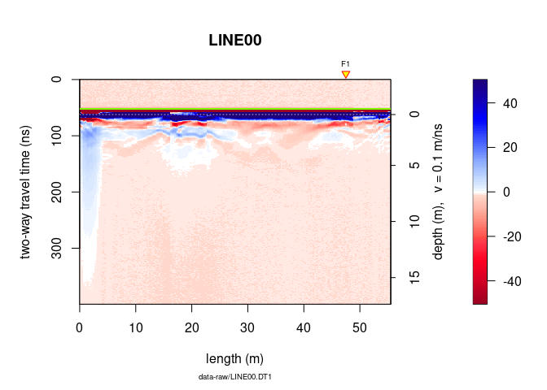
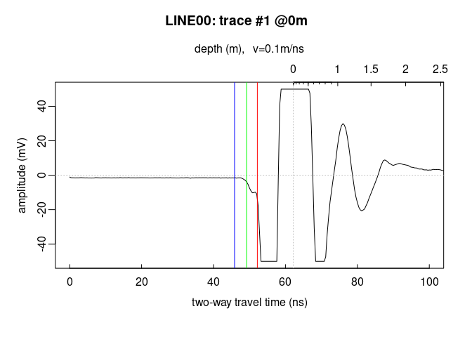

--- 
layout: page  
title: Pipe processing  
date: 2026-09-30  
---

<!--
"/media/huber/Elements/UNIBAS/software/codeR/package_RGPR/RGPR-gh-pages/2014_04_25_frenke"
"G:/UNIBAS/software/codeR/package_RGPR/RGPR-gh-pages/2014_04_25_frenke"
-->

------------------------------------------------------------------------

**Note**:

- This R-package is still in development, and therefore some of the
  functions may change in a near future.
- If you have any questions, comments or suggestions, feel free to
  contact me (in english, french or german): <emanuel.huber@pm.me>.

# Table of Contents

- [Objectives of this tutorial](#objectives-of-this-tutorial)
- [Preliminary](#preliminary)
  - [Install/load `RGPR`](#installload-rgpr)
  - [The GPR data](#the-gpr-data)
  - [Compute time zero](#compute-time-zero)
- [Using the pipe operators with
  RPGR](#using-the-pipe-operators-with-rpgr)
  - [Basic piping](#basic-piping)
  - [The `|>` pipe operator](#the--pipe-operator)

# Objectives of this tutorial

- Learn how to use the pipe operator `%>%` to process elegantly GPR
  data.

# Preliminary

- Read the tutorial [Basic GPR data
  processing](http://emanuelhuber.github.io/RGPR/01_RGPR_tutorial_basic-processing/)
  to learn more about the processing methods

## Install/load `RGPR`

``` r
# install "remotes" if not already done
if(!require("remotes")) install.packages("remotes")
remotes::install_github("emanuelhuber/RGPR")
library(RGPR)       # load RGPR in the current R session
```

## The GPR data

`RPGR` comes along with a GPR data called `frenkeLine00`. Because this
name is long, we set `x` equal to `frenkeLine00`:

``` r
x <- frenkeLine00
plot(x)
```



## Compute time zero

``` r
tfb <- firstBreak(x, w = 10, method = "coppens", thr = 0.05)
plot(x[,1], relTime0 = FALSE, xlim = c(0, 100))
t0 <- firstBreakToTime0(tfb[1], x[,1])
abline(v = c(tfb[1], t0[1]), col = c("green", "blue"))
```



# Using the pipe operators with RPGR

## Basic piping

Here a short excerpt that explains how to use pipe operators:

<https://rstudio-pubs-static.s3.amazonaws.com/1368525_31210c1c422f4faa9c8df4364ea8543d.html>

**Note:** In the following, we will only focus on the base R pipe
operator `|>`.

> The operators pipe their left-hand side values forward into
> expressions that appear on the right-hand side, i.e. one can replace
> `f(x)` with `x |> f()`, where `|>` is the pipe operator.

- `x |> f` is equivalent to `f(x)`
- `x |> f(y)` is equivalent to `f(x, y)`
- `x |> f |> g |> h` is equivalent to `h(g(f(x)))`

With pipe operators, the code is more compact and better readable.

## The `|>` pipe operator

Without pipe operator, we would code something like that:

``` r
time0(x) <- t0
x1 <- dcshift(x)
x2 <- dewow(x1, type = "runmed", w = 50)
x3 <- time0Cor(x2)
x4 <- fFilter(x3, f = c(100, 280), type = "low", plotSpec = FALSE)
x5 <- gain(x4, type = "agc", w =  5)
```

The same code with the `|>` pipe operator.

``` r
xnew <- x |> 
  setTime0(t0) |>
  dcshift() |>
  dewow(type = "runmed", w = 50) |>
  time0Cor() |>
  fFilter(f = c(100, 280), type = "low", plotSpec = FALSE)  |>
  gain(type = "agc", w =  5)
```

Note that we here the `setTime0()` instead of `time0()<-`. `setTime0()`
is nothing else than a wrapper for `time0()<-`:

``` r
setTime0 <- function(x, t0){
  time0(x) <- t0
}
```

Currently, the other replace methods of `RGPR`(`function()<-`) do not
have such a wrapper. Don’t hesitate to write you own wrapper.
