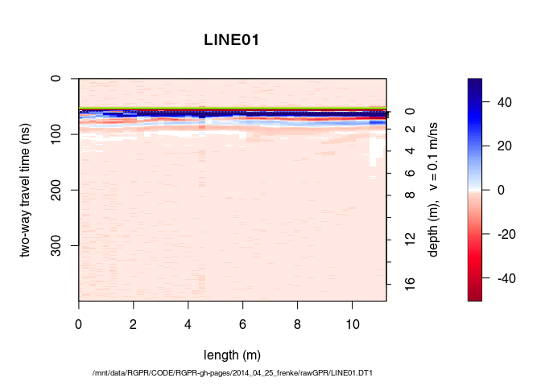

<!--
"/media/huber/Elements/UNIBAS/software/codeR/package_RGPR/RGPR-gh-pages/2014_04_25_frenke")
"G:/UNIBAS/software/codeR/package_RGPR/RGPR-gh-pages/2014_04_25_frenke"
-->
Table of Contents
-----------------

-   [Objectives of this tutorial](#objectives-of-this-tutorial)
-   [Preliminary](#preliminary)
    -   [File organisation](#file-organisation)
    -   [Install/load `RGPR` and set the working directory](#install/load-%60rgpr%60-and-set-the-working-directory)
    -   [Getting help](#getting-help)
-   [Read GPR data](#read-gpr-data)
-   [Basic processing steps](#basic-processing-steps)
    -   [First wave break and time zero estimation](#first-wave-break-and-time-zero-estimation)
    -   [DC shift removal](#dc-shift-removal)
    -   [Time zero correction](#time-zero-correction)
    -   [Dewow](#dewow)
    -   [Frequency filter](#frequency-filter)
    -   [Amplitude gain](#amplitude-gain)
        -   [Power gain](#power-gain)
        -   [Exponential gain](#exponential-gain)
    -   [inverse normal transformations](#inverse-normal-transformations)
    -   [Median filter (spatial filter)](#median-filter-(spatial-filter))
    -   [Frequency-wavenumber filter (f-k-filter)](#frequency-wavenumber-filter-(f-k-filter))
    -   [Processing overview](#processing-overview)
    -   [Other processing functions](#other-processing-functions)
        -   [Trace average removal](#trace-average-removal)
        -   [Eigen Image Filter](#eigen-image-filter)
        -   [Background matrix substraction](#background-matrix-substraction)
    -   [Save and export](#save-and-export)
    -   [Read the saved GPR data](#read-the-saved-gpr-data)
-   [Some final thoughts](#some-final-thoughts)

------------------------------------------------------------------------

**Note**:

-   This R-package is still in development, and therefore some of the functions may change in a near future.
-   If you have any questions, comments or suggestions, feel free to contact me (in english, french or german): <emanuel.huber@alumni.ethz.ch>.

Objectives of this tutorial
===========================

-   Learn how to add coordinates to the GPR data.
-   Learn how to plot the GPR data from your survey all together.

However, this tutorial will not explain you the math/algorithms behind the different processing methods.

Preliminary
===========

-   Download the data [2014\_04\_25\_frenke.zip](http://emanuelhuber.github.io/RGPR/2014_04_25_frenke.zip)
-   Unzip the data

File organisation
-----------------

I suggest to organise your files and directories as follows:

    /2014_04_25_frenke
        /processing      (here you will save the processed GPR files)
        /rawGPR          (the raw GPR data, never modify them!)
        /coord           (coordinates data)
            /FID         (fiducial marker files)
            /FIDmod      (modified fiducial marker files)
            /shapefiles  (here you will export the coordinate shapefiles)
            /topo        (ASCII files containing the trace coordinates)
        measured_coordinates.txt  (the topographic field measurements)
        RGPR_tutorial.R           (this is you R script for this tutorial)

Install/load the necessary packages
-----------------------------------

Load the packages `RGPR` and `rChoiceDialogs` (`rChoiceDialogs` provides a collection of portable choice dialog widgets):

``` r
library(RGPR)   # load RGPR in the current R session
library(rChoiceDialogs)
```

\[optionally\] If `RGPR` is not installed, follow the instructions of the tutorial "Getting started" to install it.\[optionally\] If R answers you `there is no package called 'rChoiceDialogs'` you need first to install `rChoiceDialogs`, either through your R software or directly in R with:

``` r
install.packages("rChoiceDialogs")
```

The warnings that R shows can be ignored.

Set the working directory
-------------------------

The working directory must be correctly set to use relative filepath. The working directory can be set either in your R-software or in R directly with (of course you need to change the filepath shown below):

``` r
myDir <- file.path(c("/media/huber/Elements/UNIBAS/software/codeR",
                     "package_RGPR/RGPR-gh-pages/2014_04_25_frenke"))
setwd(myDir)    # set the working directory
getwd()         # Return the current working directory (just to check)
```

\[optionally\] Alternatively, you can use an interactive dialog box from the R-package `rChoiceDialogs`:

``` r
myDir <- rchoose.dir(default = "/home/huber/WORK/UNIBAS/RESEARCH/RGPR/")
setwd(myDir)    # set the working directory
getwd()         # Return the current working directory (just to check)
```

Read all the GPR data in a object of the class `GPRsurvey`
==========================================================

An object of the class `GPRsurvey` is like an index that contains some of the meta-data of several GPR data recorded during one survey. With the class `GPRsurvey` you have an overview of all your data, you can compute the positions of the profile intersections, plot a top view of the survey and plot the data in 3D with open-GL (implemented in the R-package `RGL`).

Set the filepaths
-----------------

Read all the GPR records (".DT1") located in the directory `/rawGPR` with the exception of the file `CMP.DT1` and create an object of the class `GPRsurvey`. To indicate the filepaths of the GPR data to R you have the following options:

-   use a dialogue window

    ``` r
    # select all the GPR files except CMP.DT1
    LINES <- rchoose.files(caption = " DT1 files", filters = c("dt1","*.dt1"))
    ```

-   write manually all the filepath in a list

    ``` r
    # select all the GPR files except CMP.DT1
    LINES <- c()    # initialisation
    LINES[1] <- file.path(getwd(), "rawGPR/LINE00.DT1")
    LINES[2] <- file.path(getwd(), "rawGPR/LINE01.DT1")
    LINES[3] <- file.path(getwd(), "rawGPR/LINE02.DT1")
    LINES[4] <- file.path(getwd(), "rawGPR/LINE03.DT1")
    LINES[5] <- file.path(getwd(), "rawGPR/LINE04.DT1")
    ```

-   take advantages of vectorized code

    ``` r
    LINES <- file.path(getwd(), "rawGPR",
                       paste0("LINE", sprintf("%02d", 0:4),".DT1"))
    ```

-   extract automatically all the GPR file from the directory

    ``` r
    # list of the filepath
    allFilesinDir <- list.files(file.path(getwd(), "rawGPR"))
    allFilesinDir
    ```

        ##  [1] "CMP.DT1"    "CMP.GPS"    "CMP.HD"     "LINE00.DT1" "LINE00.GPS"
        ##  [6] "LINE00.HD"  "LINE01.DT1" "LINE01.GPS" "LINE01.HD"  "LINE02.DT1"
        ## [11] "LINE02.GPS" "LINE02.HD"  "LINE03.DT1" "LINE03.GPS" "LINE03.HD"
        ## [16] "LINE04.DT1" "LINE04.GPS" "LINE04.HD"

    ``` r
    # now, select only the file ending with.DT1 and without "CMP"
    # in their names
    selDT1 <- grepl("(.DT1)$", allFilesinDir, ignore.case = TRUE) &
!grepl("CMP", allFilesinDir, ignore.case = TRUE)
    LINES <- file.path(getwd(), "rawGPR", allFilesinDir[selDT1])
    ```

Create an object of the class `GPRsurvey`
-----------------------------------------

``` r
mySurvey <- GPRsurvey(LINES)
```

Have a look at the newly created object:

``` r
mySurvey
```

    ## *** Class GPRsurvey ***
    ## Unique directory: /mnt/data/huber/Documents/WORKNEW/GPR_Project/RGPR-gh-pages/2014_04_25_frenke/rawGPR
    ## - - - - - - - - - - - - - - -
    ##     name length units       date freq coord int   filename
    ## 1 LINE00  55.75     m 2014-04-25  100    NO  NO LINE00.DT1
    ## 2 LINE01  11.50     m 2014-04-25  100    NO  NO LINE01.DT1
    ## 3 LINE02  68.75     m 2014-04-25  100    NO  NO LINE02.DT1
    ## 4 LINE03  90.00     m 2014-04-25  100    NO  NO LINE03.DT1
    ## 5 LINE04 111.25     m 2014-04-25  100    NO  NO LINE04.DT1
    ## ****************

You can see that no coordinates (x,y,z) are associated with the GPR data. Therefore, if you try to plot the suvey you will get:

``` r
plot(mySurvey, asp = 1) # throw an error
```

Note that the object `mySurvey` only contains the meta-data and a link to the GPR files (that are stored in your working directory). But `mySurvey` does not contains the GPR data itself (i.e. the traces). However, we can ask `mySurvey` to read the data and return it in the form of an object of the class `GPR`. There are two possibilities:

-   Either subset `mySurvey` with `[[ ]]`

    ``` r
    A02 <- mySurvey[[3]]
    A02
    ```

        ## *** Class GPR ***
        ##  name        = LINE02
        ##  filepath    = /mnt/data/huber/Documents/WORKNEW/GPR_Project/RGPR-gh-pages/2014_04_25_frenke/rawGPR/LINE02.DT1
        ##  description =
        ##  survey date = 2014-04-25
        ##  Reflection, 100 MHz, Window length = 399.6 ns, dz = 0.4 ns
        ##  275 traces, 68.5 m
        ##  ****************

-   Or get the `GPR` object with the function `getGPR()`

    ``` r
    A02 <- getGPR(mySurvey, id = "LINE02")
    A02
    ```

        ## *** Class GPR ***
        ##  name        = LINE02
        ##  filepath    = /mnt/data/huber/Documents/WORKNEW/GPR_Project/RGPR-gh-pages/2014_04_25_frenke/rawGPR/LINE02.DT1
        ##  description =
        ##  survey date = 2014-04-25
        ##  Reflection, 100 MHz, Window length = 399.6 ns, dz = 0.4 ns
        ##  275 traces, 68.5 m
        ##  ****************

You can also directly plot the GPR data with:

``` r
# instead of 'A02 <- mySurvey[[3]]' and 'plot(A02)' do:
plot(mySurvey[[2]])
```



Add coordinates
===============

There are two options: (1) either you already have the coordinates of each traces or (2) you have the coordinates of points that were marked in the GPR data using fiducial marker.

Option 1: all the trace coordinates are already known
-----------------------------------------------------

We assume that for each GPR record there is a file containing the (x, y, z) coordinates of every traces. The header of these files is "E", "N", "Z" instead of "x", "y", "z" because in topography "x" sometimes designates the North ("N") and not the East ("E") as we would expect. The designation "E", "N", "Z" is less prone to confusion and therefore we chose it!

1.  Define the filepaths to the topo files:

    ``` r
    # select all the GPR files except CMP.DT1
    TOPO <- file.path(getwd(), "coord", "topo",
                      paste0("LINE", sprintf("%02d", 0:4), ".txt"))
    ```

2.  Read all the ASCII files with the function `readTopo()` that creates a list that contains the coordinates of every traces (`readTopo()` will automatically detect the column separator as well as the presence of header in the ASCII files):

    ``` r
    TOPOList <- readTopo(TOPO)
    ```

        ## read /mnt/data/huber/Documents/WORKNEW/GPR_Project/RGPR-gh-pages/2014_04_25_frenke/coord/topo/LINE00.txt...

        ## read /mnt/data/huber/Documents/WORKNEW/GPR_Project/RGPR-gh-pages/2014_04_25_frenke/coord/topo/LINE01.txt...

        ## read /mnt/data/huber/Documents/WORKNEW/GPR_Project/RGPR-gh-pages/2014_04_25_frenke/coord/topo/LINE02.txt...

        ## read /mnt/data/huber/Documents/WORKNEW/GPR_Project/RGPR-gh-pages/2014_04_25_frenke/coord/topo/LINE03.txt...

        ## read /mnt/data/huber/Documents/WORKNEW/GPR_Project/RGPR-gh-pages/2014_04_25_frenke/coord/topo/LINE04.txt...

3.  Set the list of coordinates as the new coordinates to the GPRsurvey object:

    ``` r
    coords(mySurvey) <- TOPOList
    ```

Option 2: some trace coordinates exist
--------------------------------------

The file `coord/measured_coordinates.txt` shows some of the surveyed coordinates. The content of the file is shown below.

    GPR survey 25 April 2014, Frenkental
    Coordinates reference system: CH1903+ / LV95

    XLINE00
    START 2622172.58, 1256908.26 346.7
    FID1  2622218.98, 1256906.46 345.9
    END   2622229.68, 1256905.16 345.9

    XLINE01
    START 2622233.08, 1256905.76    346
    END     2622244.28, 1256905.16 346

    XLINE02
    START 2622229.98, 1256905.56 345.9
    END   2622226.08, 1256842.96 346.7

    XLINE03
    START   2622226.08, 1256842.96 346.7
    FID1    2622265.48, 1256843.26 344
    END     2622269.08, 1256842.96 343.4

    XLINE04
    START   2622262.98, 1256834.06 343.8
    FID2    2622265.48, 1256843.26 344
    END     2622300.41, 1256921.53 343.5

You observe that the coordinates of the begining and end of each GPR profile are known and that the coordinates of some fiducial markers were also surveyed.

1.  Now, you have to indicate R to which traces the coordinates correspond. That means, for each GPR data you have to create a file that contains the coordinates with the associated trace number. This is a lot of work. To help you to create these files, use the function `exportFid()`. This function create for each GPR data a file containing the trace number, position for the start and end positions as well as for the fiducial makers.

    ``` r
    exportFid(mySurvey, fPath = file.path(getwd(), "coord/FID/"))
    ```

    Here is the FID file for the GPR data `LINE04` (`coord/FID/LINE04.txt`):

        TRACE POSITION COMMENT
        1 0 START
        91 22.5 F1
        100 24.75 F2
        122 30.25 F3
        445 111 END

2.  Now, add to each FID files three columns corresponding to the trace coordinates. You have three posibilities:

    -   The first 4 columns correspond to "x", "y", "z" and trace number ("TRACE"), e.g.

            u1 u2 u3 TRACE POSITION COMMENT
            2622262.98 1256834.06 343.8 1 0 START
            2622265.48 1256843.26 344 100 24.75 F2
            2622300.41 1256921.53 343.5 445 111 END

    -   The columns corresponding to "x", "y", "z" and trace number ("TRACE") have the column names "E", "N", "Z", and "TRACE" and the column position does not matter,e.g.

            TRACE POSITION COMMENT E N Z
            1 0 START 2622262.98 1256834.06 343.8
            100 24.75 F2 2622265.48 1256843.26 344
            445 111 END 2622300.41 1256921.53 343.5

    -   The columns corresponding to "x", "y", "z" and trace number ("TRACE") have the column names "x", "y", "z", and "TRACE" (or "X", "Y", "Z", and "TRACE") and the column position does not matter,e.g.

            TRACE POSITION COMMENT x y z
            1 0 START 2622262.98 1256834.06 343.8
            100 24.75 F2 2622265.48 1256843.26 344
            445 111 END 2622300.41 1256921.53 343.5

    Note that the two lines with the fiducial markers F1 and F3 were removed as no coordinates are available for these markers. Save the modified files in the directory `coord/FIDmod`.

3.  Read the modified fiducial marker files usind the funtion `readFID()`:

    ``` r
    FidFiles <- file.path(getwd(), "coord", "FIDmod",
                          paste0("LINE", sprintf("%02d", 0:4), ".txt"))
    ```

    ``` r
    FIDs <- readFID(FidFiles)
    ```

4.  Interpolate the coordinates of the traces for all the GPR profiles according to the modified fiducial marker files. The function `interpPos()` interpolate the position of the traces from the known trace positions and add the interpolated trace position to the object `mySurvey`.

    ``` r
    # interpolating the positions of the traces between the fiducials for each
    # GPR-lines and adding the position to the survey.
    # + compute the intersection between the GPR-lines
    # windows open for checking purposes
    # dx should be between 0.1 m and 0.5 m
    mySurvey <- interpPos(mySurvey, FIDs)
    ```

        ## LINE00: mean dx = 0.258, range dx = [0.244, 0.337]

        ## LINE01: mean dx = 0.249, range dx = [0.249, 0.249]

        ## LINE02: mean dx = 0.229, range dx = [0.229, 0.229]

        ## LINE03: mean dx = 0.12, range dx = [0.027, 0.18]

        ## LINE04: mean dx = 0.215, range dx = [0.096, 0.253]

        ## Coordinates of the local system: 2622000 1256834 0

    The function `interpPos()` prints for every GPR record the mean trace spacing as well as the trace spacing range. Normally, these values should be close to the operating settings. In this case, the trace spacing was set equal to $0.25\,m$     on the field. The trace spacing values for `XLINE00`, `XLINE01` and `XLINE02` looks good. However, the trace spacing for `XLINE04` and more particularly for `XLINE03` could be critic (the smallest trace spacing values are very low). You should check and if necessary correct the topographic data...

Setting the coordinate reference system
---------------------------------------

Setting the coordinate reference system is important when exporting the coordinate data in geospatial data format, because it allows the coordinates to be correctly projected in other coordinate reference systems. The topographic data were measured within the new Swiss coordinate system (datum: CH1903+, reference frame: LV95) that can be defined with the code EPSG $2056$ that corresponds to the new Swiss coordinate system.

``` r
crs(mySurvey) <- "+init=epsg:2056"
```

Export the coordinates
----------------------

To export the coordinates as shapefiles (one shapefile for all the GPR records), enter:

``` r
exportCoord(mySurvey, fPath="coord/shapefiles/frenke")
```

To export the coordinates as ASCII (`.txt`) files (on file per GPR record):

``` r
exportCoord(mySurvey, folder="coord/topo", type="ASCII")
```

Remark
------

Note that the coordinates are added to the object `mySurvey` but not to the GPR file. Unless you save the GPR data you will lose the coordinates when you will quit R. To save the GPR data, see\[Save, export\]\[\].

Plot functions
==============

Plot the survey
---------------

Use the `plot()` function

``` r
plot(mySurvey)
```

 The red arrows indicate the direction of the survey, the red dots the fiducial markers and the circles the GPR profile intersections.

Plot the GPR data
-----------------

To plot the first GPR record, enter:

``` r
plot(mySurvey[[1]], addTopo=TRUE)
```

    ## time to depth conversion with constant velocity (0.1 m/ns)


Three-dimensional plot of the GPR data
--------------------------------------

To plot all the GPR records with the topographic information in 3D, enter:

``` r
plot3DRGL(mySurvey, addTopo = TRUE)
```

Enlarge the window, use the mouse to move the view and zoom in.

<a name="pookie"></a>Processing, save and PDF export
----------------------------------------------------

Once you found a satisfactory combination of processing steps, you can apply them all the GPR data. Here is an example

Create a sub-directory in the `/processing` directory (name it `mySurveyProc`):

``` r
procDir <- file.path(getwd(), "processing/mySurveyProc")
dir.create(file.path(procDir), showWarnings = TRUE)
```

Now apply the processing step with a loop to all GPR data indexed by `mySurvey`:

``` r
for(i in seq_along(mySurvey)){
  A <- mySurvey[[i]]            # get GPR-line no. i
  cat("processing of line", name(A),"      ")
  A <- dcshift(A, 1:100)          # DC-shift
  A <- gain(A, type = "power", alpha = 1, te = 200, tcst = 100)
  A <- fFilter(A, f= c(150, 200), type = "low", plotSpec = FALSE)
  A <- gain(A, type = "exp", alpha = 0.1, t0 = 50, te = 180)
  A <- dewow(A, type = "MAD", w = 50)              # dewow
  A <- filter2D(A, type = "median3x3")
  # export PDF
 exportPDF(A, clip = 30, fPath = file.path(procDir, name(A)), addTopo = TRUE,
          lwd = 0.5, ws = 1.5)
  # save the processed GPR-line into ".rds" format
  writeGPR(A, fPath = file.path(procDir, paste0(name(A),".rds")),
          type = "rds", overwrite = TRUE)
  cat("!\n")
}
```

### Read again

Next time you can directly load the processed files as follows:

``` r
# select all the GPR files except CMP.DT1
procLINES <- file.path(procDir, paste0("LINE", sprintf("%02d", 0:4), ".rds"))
```

``` r
procSurvey <- GPRsurvey(procLINES)
```

and check the results:

``` r
plot(procSurvey[[1]], addTopo=TRUE)
plot3DRGL(procSurvey, addTopo = TRUE)
```

Alternative: sequentially apply the processing steps on an object of the class GPRsurvey
----------------------------------------------------------------------------------------

Create a list of lists defining the processing steps. The name of each sublist (e.g., `agc`) correspond to the name of the processing function, each sublist corresponds to the argument = values as defined by the corresponding processing function. For example

``` r
prc <- list("gain"    = list(type = "agc", w = 10),
            "dewow"   = list(type = "Gaussian", w = 15),
            "fFilter" = list(f = c(10, 40, 150, 200), type = "bandpass",
                             plotSpec = FALSE))
```

Then, apply all the processing steps with the function `papply()` to the `GPRsurvey` object `mySurvey`

``` r
mySurveyProc <- RGPR::papply(mySurvey, prc)
```

What do `papply()` do? It applies the processing steps as in the for-loop in the previous section and stores locally the processed GPR data on your local computer (temp files). That means that if you want to use the processed GPR data in another R session, you still need to save them manually, for example with the function `writeGPR()`:

``` r
writeGPR(mySurveyProc, fPath = procDir, type = "rds")
```
