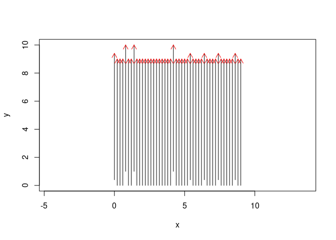
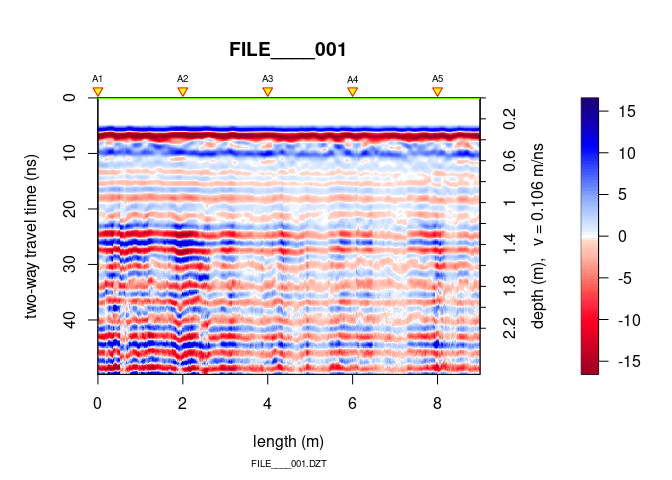
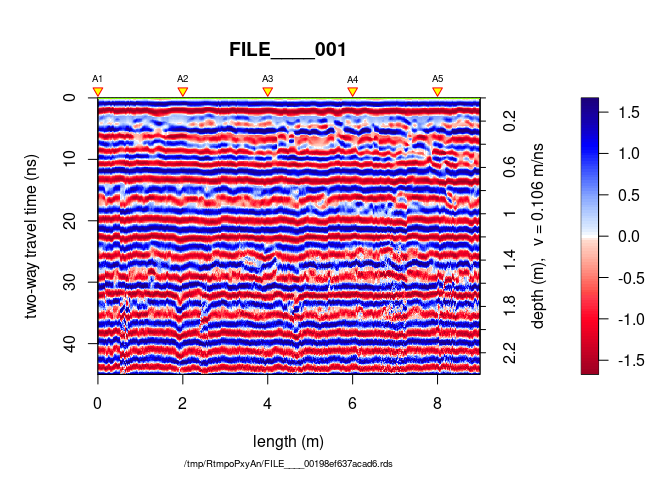
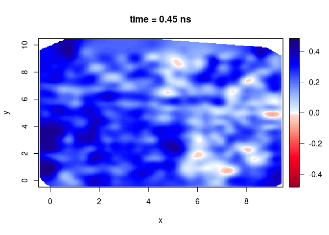
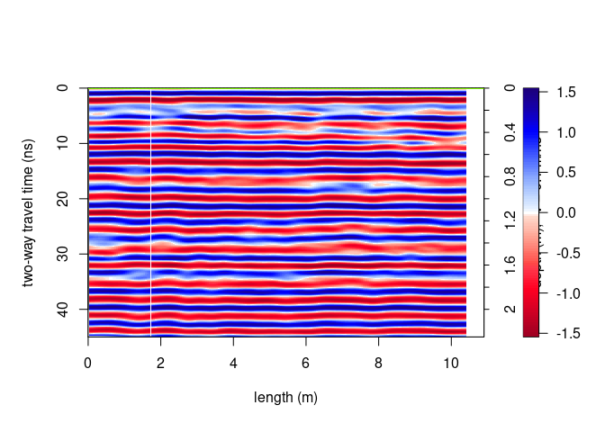
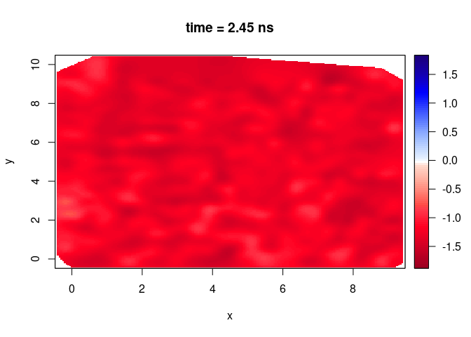
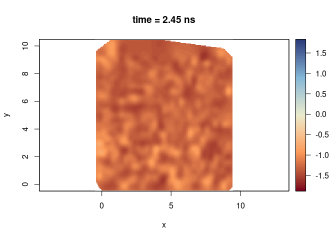

------------------------------------------------------------------------

**Note**:

-   This R-package is still in development, and therefore some of the functions may change in a near future.
-   If you have any questions, comments or suggestions, feel free to contact me (in english, french or german): <emanuel.huber@alumni.ethz.ch>.

Table of Contents
=================

-   [Objectives of this tutorial](#objectives-of-this-tutorial)
-   [Preliminary](#preliminary)
    -   [Install/load the necessary packages](#installload-the-necessary-packages)
    -   [Set the working directory](#set-the-working-directory)
-   [Read all the GPR data in a object of the class `GPRsurvey`](#read-all-the-gpr-data-in-a-object-of-the-class-gprsurvey)
    -   [Set the filepaths](#set-the-filepaths)
    -   [Create an object of the class `GPRsurvey`](#create-an-object-of-the-class-gprsurvey)
-   [Add coordinates](#add-coordinates)
    -   [Reverse GPR line direction (if necessary)](#reverse-gpr-line-direction-if-necessary)
    -   [Set grid coordinaes](#set-grid-coordinaes)
-   [Basic processing](#basic-processing)
-   [Time/depth slice interpolation](#timedepth-slice-interpolation)

Objectives of this tutorial
===========================

-   Learn how to assign coordinates to GPR data from a grid survey setup.
-   Learn how to interpolate time/depth slices.

However, this tutorial will not explain you the math/algorithms behind the different processing methods.

Preliminary
===========

-   Download the repository [GPRdata](https://github.com/NSGeophysics/GPRdata) containing the data we will use along this tutorial
-   Unzip the data

We will work with the data contained in the directory `/exampleDataCube/Grid-dir1-Rawdata/`.

Install/load the necessary packages
-----------------------------------

``` r
if(!require("devtools")) install.packages("devtools")
devtools::install_github("emanuelhuber/RGPR")
library(RGPR)   # load RGPR in the current R session
```

\[optionally\] If `RGPR` is not installed, follow the instructions of the tutorial "Getting started" to install it.

Set the working directory
-------------------------

The working directory must be correctly set to use relative filepaths. The working directory can be set either in your R-software or in R directly with (of course you need to adapt the filepath shown below to your system):

``` r
myDir <- file.path("your_dir_path/GPRdata-master/exampleDataCube"))
setwd(myDir)    # set the working directory
getwd()         # Return the current working directory (just to check)
```

Read all the GPR data in a object of the class `GPRsurvey`
==========================================================

An object of the class `GPRsurvey` is like an index that contains some of the meta-data of several GPR data recorded during one survey. With the class `GPRsurvey` you have an overview of all your data, you can compute the positions of the profile intersections, plot a top view of the survey and plot the data in 3D with open-GL (implemented in the R-package `RGL`).

Set the filepaths
-----------------

Read all the GPR records (".DZT") located in the directory `/exampleDataCube/Grid-dir1-Rawdata/`

    ```r
    LINES <- file.path( paste0("FILE____", sprintf("%03d", 1:46), ".DZT"))
    ```

`sprintf` format the integer values ranging from 1 to 46 such that they match the file names (e.g., 1 becomes 001, 2 becomes 002,..., 46 becomes 046). The `0` in `"%03d"` means pad with zeros to the field, `3` means that the field length is `3`, `d` that the values are integer.

Create an object of the class `GPRsurvey`
-----------------------------------------

``` r
SU <- GPRsurvey(LINES, verbose = FALSE)
```

Have a look at the newly created object:

``` r
SU
```

    ## *** Class GPRsurvey ***
    ## Unique directory:.
    ## - - - - - - - - - - - - - - -
    ##           name length units       date freq coord int        filename
    ## 1  FILE____001    9.0     m 2013-10-29  400    NO  NO FILE____001.DZT
    ## 2  FILE____002    9.0     m 2013-10-29  400    NO  NO FILE____002.DZT
    ## 3  FILE____003    9.0     m 2013-10-29  400    NO  NO FILE____003.DZT
    ## 4  FILE____004    9.0     m 2013-10-29  400    NO  NO FILE____004.DZT
    ## 5  FILE____005    9.0     m 2013-10-29  400    NO  NO FILE____005.DZT
    ## 6  FILE____006    9.0     m 2013-10-29  400    NO  NO FILE____006.DZT
    ## 7  FILE____007    9.0     m 2013-10-29  400    NO  NO FILE____007.DZT
    ## 8  FILE____008    9.0     m 2013-10-29  400    NO  NO FILE____008.DZT
    ## 9  FILE____009    9.0     m 2013-10-29  400    NO  NO FILE____009.DZT
    ## 10 FILE____010    9.0     m 2013-10-29  400    NO  NO FILE____010.DZT
    ## 11 FILE____011    9.0     m 2013-10-29  400    NO  NO FILE____011.DZT
    ## 12 FILE____012    9.0     m 2013-10-29  400    NO  NO FILE____012.DZT
    ## 13 FILE____013    9.0     m 2013-10-29  400    NO  NO FILE____013.DZT
    ## 14 FILE____014    9.0     m 2013-10-29  400    NO  NO FILE____014.DZT
    ## 15 FILE____015    9.0     m 2013-10-29  400    NO  NO FILE____015.DZT
    ## 16 FILE____016    9.0     m 2013-10-29  400    NO  NO FILE____016.DZT
    ## 17 FILE____017    9.0     m 2013-10-29  400    NO  NO FILE____017.DZT
    ## 18 FILE____018    9.0     m 2013-10-29  400    NO  NO FILE____018.DZT
    ## 19 FILE____019    9.0     m 2013-10-29  400    NO  NO FILE____019.DZT
    ## 20 FILE____020    9.0     m 2013-10-29  400    NO  NO FILE____020.DZT
    ## 21 FILE____021    9.0     m 2013-10-29  400    NO  NO FILE____021.DZT
    ## 22 FILE____022    9.0     m 2013-10-29  400    NO  NO FILE____022.DZT
    ## 23 FILE____023    9.0     m 2013-10-29  400    NO  NO FILE____023.DZT
    ## 24 FILE____024    9.0     m 2013-10-29  400    NO  NO FILE____024.DZT
    ## 25 FILE____025    9.0     m 2013-10-29  400    NO  NO FILE____025.DZT
    ## 26 FILE____026    9.0     m 2013-10-29  400    NO  NO FILE____026.DZT
    ## 27 FILE____027    9.0     m 2013-10-29  400    NO  NO FILE____027.DZT
    ## 28 FILE____028    9.0     m 2013-10-29  400    NO  NO FILE____028.DZT
    ## 29 FILE____029    9.0     m 2013-10-29  400    NO  NO FILE____029.DZT
    ## 30 FILE____030    9.0     m 2013-10-29  400    NO  NO FILE____030.DZT
    ## 31 FILE____031    9.0     m 2013-10-29  400    NO  NO FILE____031.DZT
    ## 32 FILE____032    9.0     m 2013-10-29  400    NO  NO FILE____032.DZT
    ## 33 FILE____033    9.0     m 2013-10-29  400    NO  NO FILE____033.DZT
    ## 34 FILE____034    9.0     m 2013-10-29  400    NO  NO FILE____034.DZT
    ## 35 FILE____035    9.0     m 2013-10-29  400    NO  NO FILE____035.DZT
    ## 36 FILE____036    9.0     m 2013-10-29  400    NO  NO FILE____036.DZT
    ## 37 FILE____037    9.0     m 2013-10-29  400    NO  NO FILE____037.DZT
    ## 38 FILE____038    9.0     m 2013-10-29  400    NO  NO FILE____038.DZT
    ## 39 FILE____039    9.0     m 2013-10-29  400    NO  NO FILE____039.DZT
    ## 40 FILE____040    9.0     m 2013-10-29  400    NO  NO FILE____040.DZT
    ## 41 FILE____041    9.0     m 2013-10-29  400    NO  NO FILE____041.DZT
    ## 42 FILE____042    9.0     m 2013-10-29  400    NO  NO FILE____042.DZT
    ## 43 FILE____043    9.0     m 2013-10-29  400    NO  NO FILE____043.DZT
    ## 44 FILE____044    9.0     m 2013-10-29  400    NO  NO FILE____044.DZT
    ## 45 FILE____045    9.0     m 2013-10-29  400    NO  NO FILE____045.DZT
    ## 46 FILE____046    9.0     m 2013-10-29  400    NO  NO FILE____046.DZT
    ## ****************

You can see that no coordinates (x,y,z) are associated with the GPR data. Therefore, if you try to plot the survey you will get:

``` r
plot(SU, asp = 1) # throw an error
```

Add coordinates
===============

The data come without coordinates. To add coordinate to GPR data, check the tutorial [Adding coordinates to GPR data](https://emanuelhuber.github.io/RGPR/04_RGPR_tutorial_GPR-data-survey/). Note that RPGR automatically reads GPS files associated with the GPR data and interpolate the trace positions.

Here, we assume that the data were collected on a grid: all the GPR data are parallel, oriented in the same direction and spaced by 0.20 m. For grid settings, a new approach is here introduced (here only with data recorded along the y-direction, but it works also for data recorded along the x-direction and along both direction). If your data already have coordinates, skip the section below.

Reverse GPR line direction (if necessary)
-----------------------------------------

For this approach, all the data must be oriented in the same direction (the x-lines must have the same direction, the y-lines must have the same direction). If this is not the case for your data, you can use the function `reverse()` to reverse the GPR line. You can specifiy which lines must be reversed:

``` r
SU <- reverse(SU, id = seq(from = 2, to = 11, by = 2))
```

or if your data were collected in zig-zag (two adjacent GPR lines have opposite direction), you can use the argument `"zigzag"`:

``` r
#all the even GPR lines are reversed
SU <- reverse(SU, id = "zigzag")
```

Set grid coordinaes
-------------------

To set the grid coordinates, use the function `setGridCoord()` and assign the grid specifications in the form of a list. This list takes for arguments:

-   `xlines`: integer values corresponding to the x-lines in the `GPRsurvey` object (if there is no x-lines, set `xlines = NULL`).
-   `xpos`: the position of the x-lines along the x-axis (if there is no x-lines, set `xpos = NULL`).
-   `ylines`: integer values corresponding to the x-lines in the `GPRsurvey` object (if there is no y-lines, set `ylines = NULL`).
-   `ypos`: the position of the x-lines along the x-axis.

For example, if your data were collected as follows:

-   10 x-lines with line spacing = 2 m
-   5 ylines at positions 0 m, 1 m, 2 m, 4 m, and 6 m

``` r
setGridCoord(SU) <- list(xlines = 1:10,
                         xpos   = seq(0,
                                      by = 2,
                                      length.out = 10),
                         ylines = 15 + (1:10),
                         ypos   = c(0, 1, 2, 4, 6))
```

In our case we have only x-lines, so we set `ylines` and `ypos` equal to `NULL`:

``` r
setGridCoord(SU) <- list(xlines = seq_along(SU),
                         xpos   = seq(0,
                                      by = 0.2,
                                      length.out = length(SU)),
                         ylines = NULL,
                         ypos   = NULL)
```

Now you can plot your survey data (because you have coordinates)

``` r
plot(SU, asp = TRUE)
```


If you want to shift the coordinates by 1 m along x-direction, 0.5 m along the y-direction for your 3rd GPR data line, use `tpShift()` as follows

``` r
SU2 <- tpShift(SU, 3, dx = 0.1, dy = 0.5)
plot(SU2)
```



Basic processing
================

Plot a single GPR data with

``` r
plot(SU[[1]])
```

    ## Antenna separation set to 0 m. Set it with 'antsep(x) <-... '



You see that some processing is needed.

We apply some basic processing steps sequentially (estimate time-zero and shift all the traces to time-zero, dewow, AGC-gain). Maybe you want to horizontally smooth the data (un-comment the line starting `traceStat`) or to interpolate the signal envelope (un-comment the line starting `envelope`). For more info on GPR data processing check the tutorial [Basic GPR data processing](https://emanuelhuber.github.io/RGPR/02_RGPR_tutorial_basic-GPR-data-processing/)

``` r
SU <- papply(SU,
             prc = list(estimateTime0 = list(method = "coppens", w = 2),
                        # "NULL" because we take the default
                        time0Cor = NULL,
                        dewow = list(w = 3),
                        gain = list(type = "agc", w = 1.2) #,
                        # traceStat = list(w = 20, FUN = mean),
                        # envelope = NULL)
))
```

Does it look better now?

``` r
plot(SU[[1]])
```



Time/depth slice interpolation
==============================

Now that the data are well prepared, the interpolation is a simple task. We define the grid resolution in all three direction: dx = 0.05 m, dy = 0.05 m, dz = 0.05 ns as well as an additional parameter `h` (&gt;0) that controls the smoothness of the interpolation (the interpolation used is the Multilevel B-spline Approximation as implemented in the function `mba.surf()` of the package `MBA`).

``` r
SXY <- interpSlices(SU, dx = 0.05, dy = 0.05, dz = 0.05, h = 6)
SXY
```

    ## *** Class GPRcube ***
    ## dim:    180 x 180 x 901
    ## res:    0.0502793296089385 m x 0.0502793296089385 m x 0.05 ns
    ## extent: 9 m x 9 m x 45 ns
    ## crs:
    ## *********************

`SXY` can be manipulated like an array with x, y and z dimensions.

Plot an horizontal slice of the data cube:

``` r
plot(SXY[,,10])
```



Plot a vertical slice along x-direction

``` r
plot(SXY[,10,])
```


Plot a vertical slice along y-direction

``` r
plot(SXY[10,,])
```



You can define the same color range for each plot:

``` r
# color range (over all possible slice values)
clim <- range(SXY)
plot(SXY[,,50], clim = clim)
```



You can change the color palette? `displayPalGPR()` shows all the palette available in RGPR

``` r
displayPalGPR()
```


Try these two palettes: `"sunny"` and `"slice"`:

``` r
plot(SXY[,,50], clim = clim, col = palGPR("sunny"), asp = 1)
```



``` r
plot(SXY[,,50], clim = clim, col = palGPR("slice"), asp = 1)
```


