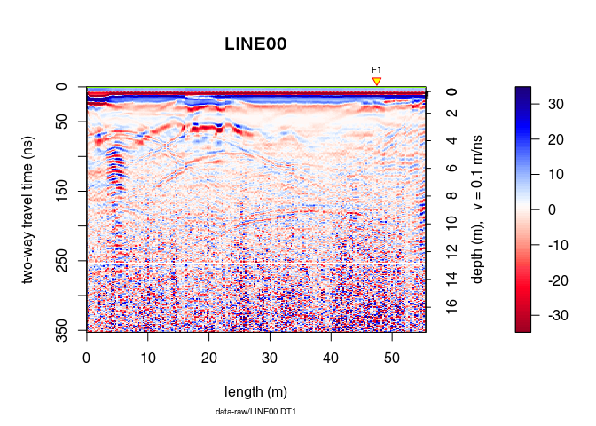
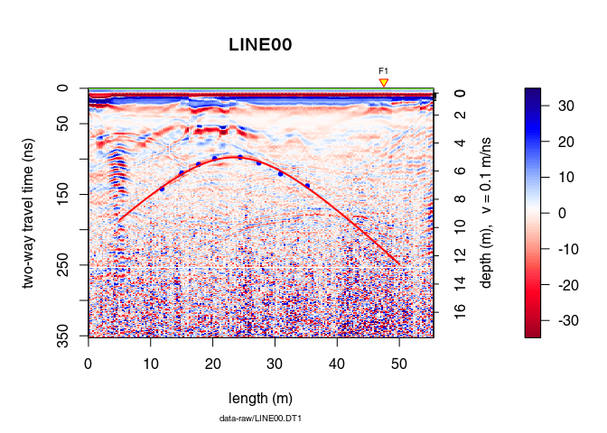
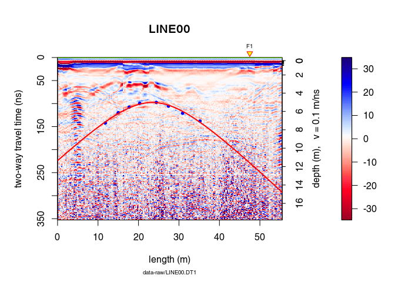
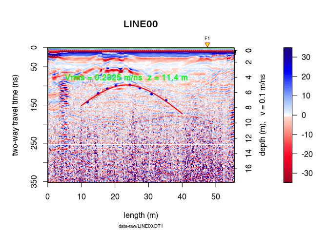
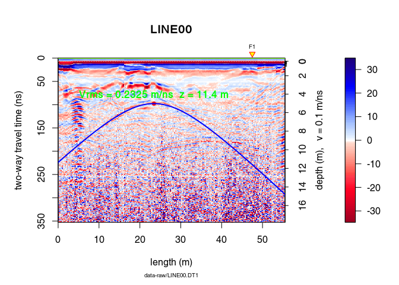
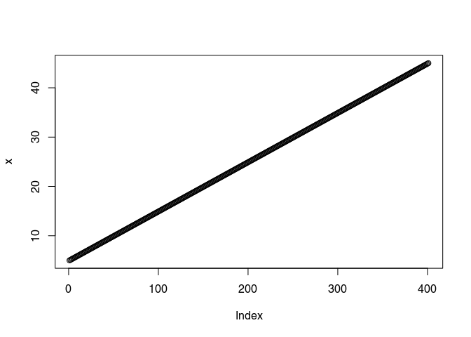

<!--
"/media/huber/Elements/UNIBAS/software/codeR/package_RGPR/RGPR-gh-pages/2014_04_25_frenke"
"G:/UNIBAS/software/codeR/package_RGPR/RGPR-gh-pages/2014_04_25_frenke"
-->

------------------------------------------------------------------------

**Note**:

-   This R-package is still in development, and therefore some of the functions may change in a near future.
-   If you have any questions, comments or suggestions, feel free to contact me (in english, french or german): <emanuel.huber@alumni.ethz.ch>.

Table of Contents
=================

-   [Objectives of this tutorial](#objectives-of-this-tutorial)
-   [Preliminary](#preliminary)
    -   [Install/load `RGPR`](#installload-rgpr)
    -   [The GPR data](#the-gpr-data)
    -   [Basic processing](#basic-processing)
-   [Hyperbola fitting](#hyperbola-fitting)
    -   [Interactive point selection and hyperbola fitting](#interactive-point-selection-and-hyperbola-fitting)
    -   [Plot the fitted hyperbola](#plot-the-fitted-hyperbola)
    -   [Plot an hyperbola defined by its vertex position and the root-mean-square velocity](#plot-an-hyperbola-defined-by-its-vertex-position-and-the-root-mean-square-velocity)
    -   [Simulate an hyperbola](#simulate-an-hyperbola)

Objectives of this tutorial
===========================

-   Learn how to fit manually a hyperbola to GPR data

Note that his tutorial will not explain you the math/algorithms behind the different processing methods.

Preliminary
===========

-   Read the tutorial [Basic GPR data processing](http://emanuelhuber.github.io/RGPR/01_RGPR_tutorial_basic-processing/) to learn more about the processing methods

Install/load `RGPR`
-------------------

``` r
# install "devtools" if not already done
if(!require("devtools")) install.packages("devtools")
devtools::install_github("emanuelhuber/RGPR")
library(RGPR)       # load RGPR in the current R session
```

The GPR data
------------

`RPGR` comes along with a GPR data called `frenkeLine00`. Because this name is long, we set `x` equal to `frenkeLine00`:

``` r
x <- frenkeLine00
plot(x)
```


Basic processing
----------------

We apply some basic processing to the data with the pipe operator (`%>%`):

``` r
x <- x %>%  estimateTime0(w = 5, method = "MER", FUN = mean) %>%
     time0Cor(method = "pchip")  %>%
     dewow(type = "Gaussian", w = 5)  %>%
     fFilter(f = c(200, 300), type = "low") %>%
     gainSEC(a = 0.003, t0 = 50)

plot(x)
```



Hyperbola fitting
=================

Interactive point selection and hyperbola fitting
-------------------------------------------------

Select points interactively on the plot with

``` r
xy <- locator(type = "l")
```

    ## $x
    ## [1] 11.8 15.0 17.7 20.3 24.4 27.4 30.9 35.2
    ##
    ## $y
    ## [1] 142.2 119.8 107.7  99.5  97.5 105.6 120.9 138.1

Fit the corresponding hyperbola with the function `hyperbolaFit()`:

``` r
hyp <- hyperbolaFit(xy)
```

Plot the fitted hyperbola
-------------------------

-   Plot the hyperbola for x-position ranging from 5 to 50:

    ``` r
    plot(x)
    points(xy, pch = 20, col = "blue")
    hyperbolaPlot(hyp, x = seq(5, 50, by = 0.01), col = "red", lwd = 2)
    ```



-   Plot the hyperbola without defining its x-position (in this case the hyperbola is displayed over the entire plot)

    ``` r
    plot(x)
    points(xy, pch = 20, col = "blue")
    hyperbolaPlot(hyp, col = "red", lwd = 2)
    ```



-   Define the hyperbola range with `xlim` and add some annotations:

    ``` r
    plot(x)
    points(xy, pch = 20, col = "blue")
    hyperbolaPlot(hyp, col = "red", lwd = 2, xlim = c(10, 40), ann = TRUE)
    ```



Plot an hyperbola defined by its vertex position and the root-mean-square velocity
----------------------------------------------------------------------------------

Define the hyperbola parameters

``` r
hyp2 <- list(x0 = hyp$x0, t0 = hyp$t0, vrms = hyp$vrms)
```

Plot the hyperbola

``` r
plot(x)
points(hyp$x0, hyp$t0, pch = 20, col = "red", cex = 1.3)
hyperbolaPlot(hyp2, col = "blue", lwd = 2, ann = TRUE)
```



Simulate an hyperbola
---------------------

-   Using the output of `hyperbolaFit()`:

    ``` r
    xv <- seq(5, 45, by = 0.1)
    y <- hyperbolaSim(xv, hyp)
    plot(x)
    points(hyp$x0, hyp$t0, pch = 20, col = "blue")
    lines(xv, y)
    ```


-   Defining its vertex position and the root-mean-square velocity:

    ``` r
    hyp2 <- list(x0 = hyp$x0, t0 = hyp$t0, vrms = hyp$vrms)
    xv <- seq(5, 45, by = 0.1)
    y <- hyperbolaSim(xv, hyp2)
    plot(x)
    lines(xv, y)
    points(hyp$x0, hyp$t0, pch = 20, col = "blue")
    ```


