<!--
"/media/huber/Elements/UNIBAS/software/codeR/package_RGPR/RGPR-gh-pages/2014_04_25_frenke"
"G:/UNIBAS/software/codeR/package_RGPR/RGPR-gh-pages/2014_04_25_frenke"
-->

------------------------------------------------------------------------

**Note**:

-   This R-package is still in development, and therefore some of the functions may change in a near future.
-   If you have any questions, comments or suggestions, feel free to contact me (in english, french or german): <emanuel.huber@alumni.ethz.ch>.

Table of Contents
=================

-   [Objectives of this tutorial](#objectives-of-this-tutorial)
-   [Preliminary](#preliminary)
    -   [Install/load `RGPR`](#installload-rgpr)
    -   [Read the data](#read-the-data)
-   [GPR data deconvolution](#gpr-data-deconvolution)
    -   [First wave break and time zero estimation](#first-wave-break-and-time-zero-estimation)
    -   [DC-shift](#dc-shift)
    -   [Time zero correction](#time-zero-correction)
    -   [Dewow](#dewow)
    -   [Frequency filter](#frequency-filter)
    -   [Time gain](#time-gain)
    -   [Mixed phase deconvolution](#mixed-phase-deconvolution)
        -   [Minimum-phase deconvolution and phase rotation](#minimum-phase-deconvolution-and-phase-rotation)
        -   [Minimum-phase and mixed-phase wavelet](#minimum-phase-and-mixed-phase-wavelet)
    -   [Frequency filter](#frequency-filter)
    -   [Trace scaling](#trace-scaling)
    -   [Comparison](#comparison)

Objectives of this tutorial
===========================

-   Learn how to apply the deconvolution scheme of Schmelzbach and Huber (2015) to GPR data

Note that his tutorial will not explain you the math/algorithms behind the different processing methods.

We follow the approach proposed by Schmelzbach and Huber (2015), Efficient Deconvolution of Ground-Penetrating Radar Data, IEEE Transactions on Geosciences and Remote Sensing 53 (9), 5209-5217, [doi:10.1109/TGRS.2015.2419235](http://dx.doi.org/10.1109/TGRS.2015.2419235).

[Download the pdf](https://emanuelhuber.github.io/publications/2015_schmelzbach-and-huber_deconvolution-gpr.pdf)

Preliminary
===========

-   Read the tutorial [Basic GPR data processing](http://emanuelhuber.github.io/RGPR/01_RGPR_tutorial_basic-processing/) to learn more about the processing methods
-   Download the data [2012\_10\_06\_cornino.zip](http://emanuelhuber.github.io/RGPR/2012_10_06_cornino.zip). The data can be also downloaded on Zenodo [](https://doi.org/10.5281/zenodo.2586189) and can be cited as follow: Huber, Emanuel (2019), GPR data used to test the efficient deconvolution method of Schmelzbach and Huber (2015), [doi:10.5281/zenodo.2586189](https://doi.org/10.5281/zenodo.2586189).
-   Unzip the data

Install/load `RGPR`
-------------------

-   Install/load `RGPR`

    ``` r
    # install "devtools" if not already done
    if(!require("devtools")) install.packages("devtools")
    devtools::install_github("emanuelhuber/RGPR")
    library(RGPR)       # load RGPR in the current R session
    ```

-   Set the working directory:

    ``` r
    DIR <- "~/2012_10_06_cornino"  # adapt that to your directory structure
    setwd(DIR)    # set the working directory
    getwd()         # Return the current working directory (just to check)
    ```

Read the data
-------------

``` r
x <- readGPR(dsn = "yyline3.DT1")
x <- x[1:300, ]
```

GPR data deconvolution
======================

First wave break and time zero estimation
-----------------------------------------

Quantify first wave break:

``` r
tfb <- firstBreak(x, w = 20, method = "coppens", thr = 0.05)
plot(pos(x), tfb, pch = 20, ylab = "first wave break",
     xlab = "position (m)")
```

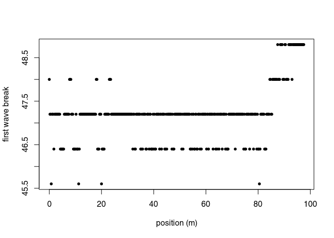

Convert first wave break to time-zero and set time-zero

``` r
t0 <- firstBreakToTime0(tfb, x)
time0(x) <- mean(t0)     # set time0
```

DC-shift
--------

``` r
x1 <- dcshift(x)
```

Time zero correction
--------------------

To shift the traces to time-zero, use the function `time0Cor` (the `method` argument defines the type of interpolation method)

``` r
x2 <- time0Cor(x1, method = "pchip")
```

Dewow
-----

Remove the low-frequency components (the so-called "wow") of the GPR record:

``` r
x3 <- dewow(x2, type = "runmed", w = 50)     # dewowing:
plot(x3)                                     # plot the result
```

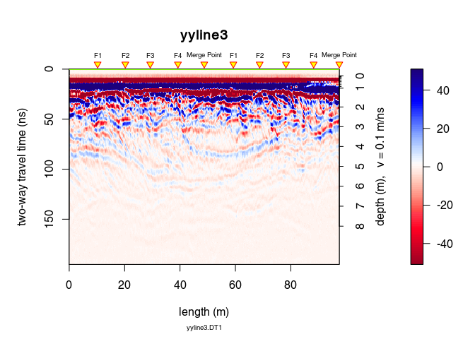

``` r
plot(x3 - x2)                           # plot the difference
```

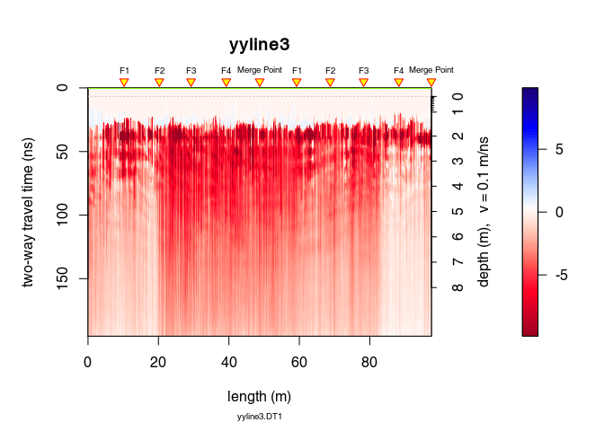

Frequency filter
----------------

To remove low (dewow) and high (noise) frequency (large bandpass to minimise the introduction of artifact)

``` r
x4 <- fFilter(x3, f = c(5, 20, 300, 400), type = "bandpass",
                plotSpec = TRUE)
```

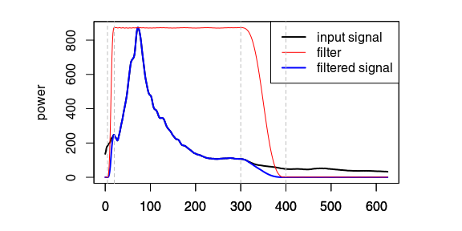

Time gain
---------

Apply a power gain and a spherical gain to compensate for geometric wave spreading and attenuation (Kruse and Jol, 2003; Grimm et al., 2006).

``` r
# power gain (compensate geometric spreading)
x5 <- gain(x4, type ="power",  alpha = 1, t0 = 0, te = 200)
# exponential gain (compensate for attenuation)
x6 <- gain(x5, type ="exp",  alpha = 0.023, t0 = 30, te = 180)

trPlot(traceStat(envelope(x4)), col = "red", main="")
trPlot(traceStat(envelope(x5)), col = "blue", add=TRUE)
trPlot(traceStat(envelope(x6)), col = "green", add=TRUE)
legend("topright",legend=c("before","power gain", "exponential gain"),
       lwd=c(1,1,1), col=c("red","blue","green"))
```

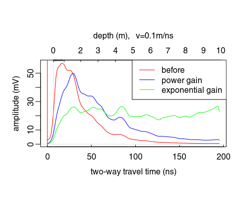

Mixed phase deconvolution
-------------------------

Select the time window on which the deconvolution will be applied:

``` r
tWin <- c(32, 112)  # ns
W <- which(depth(x6) > tWin[1] & depth(x6) < tWin[2])

plot(x6[W, ], main = "selected time window")
```

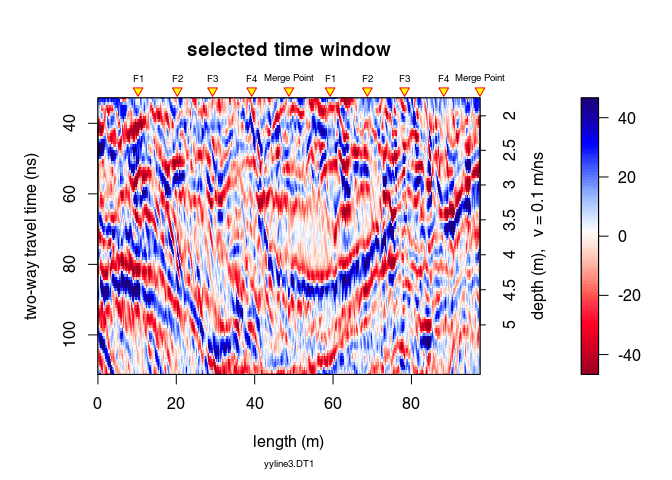

### Minimum-phase deconvolution and phase rotation

Apply the mixed-phase deconvolution: spiking deconvolution + phase rotation that maximise the kurtosis of the GPR data.

``` r
x_dec <- deconv(x6, method="mixed-phase", W = tWin, wtr = 5, nf = 35,
                mu = 0.00001)
```

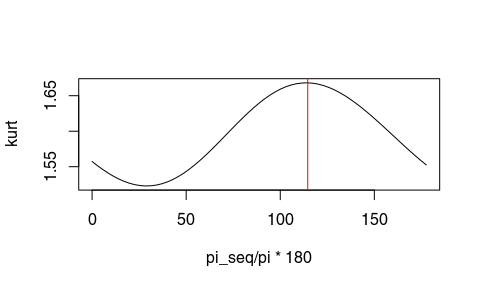

Estimated phase rotation: 114.59°.

The function `deconv()` (when `method = "mixed-phase"`) returns a list of following elements:

-   `fmin`: estimated inverse minimum-phase wavelet
-   `wmin`: estimated minimum-phase wavelet
-   `optRot`: rotation of the minimum-phase wavelet that maximise the kurtosis
-   `wmix`: estimated mixed-phase wavelet (the rotated minimum-phase wavelet)
-   `x`: the deconvolued data

You can compare the results with the "minimum-phase deconvolution" also called "spiking deconvolution" by setting in `deconv()` `method = "spiking"` (in this case, `deconv()` returns only `fmin`, `wmin` and `x`).

### Minimum-phase and mixed-phase wavelet

In black the estimated wavelets for each trace, in red the mean wavelet.

``` r
w_min <- x_dec$wmin
w_mix <- x_dec$wmix


par(mfrow=c(1,2))
plot(0,0,type="n",xlim=range(w_min$x), ylim = max(abs(w_mix$y))*c(-1,1),
      xaxs = "i", xlab = "time (ns)", ylab = "amplitude",
    main = "minimum-phase wavelet")
grid()
apply(w_min$y,2,lines, x = w_min$x, col=rgb(0.2,0.2,0.2,0.2))
lines(w_min$x, apply(w_min$y,1,mean), col="red", lwd=3)


plot(0,0,type="n",xlim=range(w_mix$x),ylim=max(abs(w_mix$y))*c(-1,1),
    xaxs = "i", xlab = "time (ns)", ylab = "amplitude",
    main = "mixed-phase wavelet")
grid()
apply(w_mix$y,2,lines, x = w_mix$x, col=rgb(0.2,0.2,0.2,0.2))
lines(w_mix$x, apply(w_mix$y,1,mean), col="red", lwd=3)
```

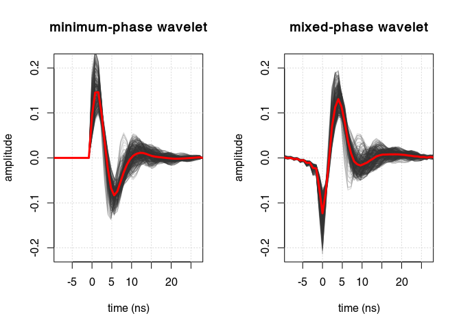

Frequency filter
----------------

To remove the high-frequency noise boosted by the deconvolution

``` r
x7 <- fFilter(x_dec$x, f = c(5, 20, 160, 210), type = "bandpass",
                    plot = TRUE)
```

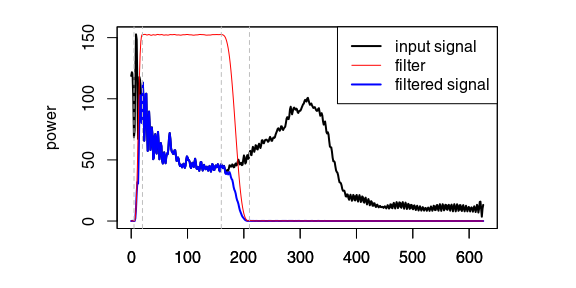

Trace scaling
-------------

``` r
x8 <- traceScaling(x7, type="stat")
```

Comparison
----------

``` r
plot(x6, main = "before deconvolution", clip = 30)
```

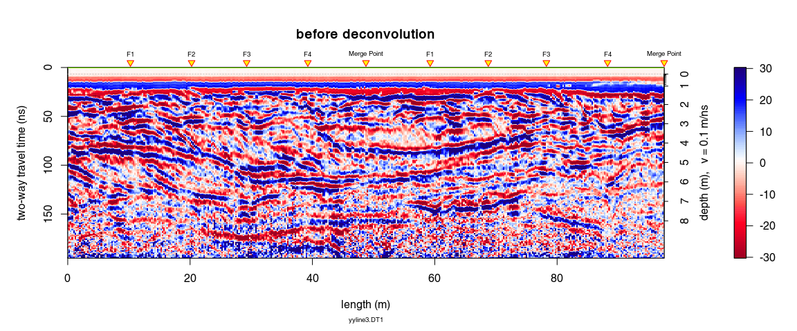

``` r
plot(x8, main = "after deconvolution",  clip = 2)
```

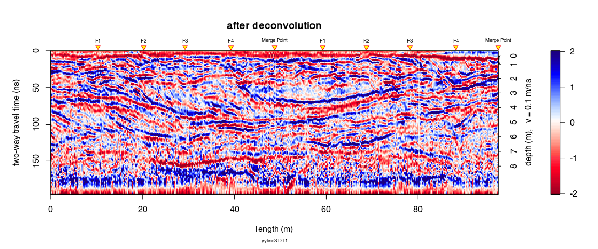
