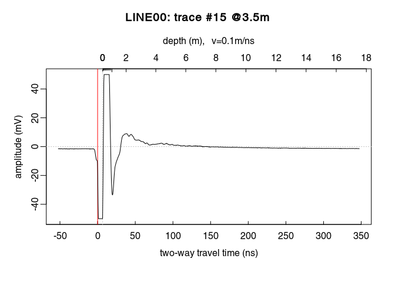
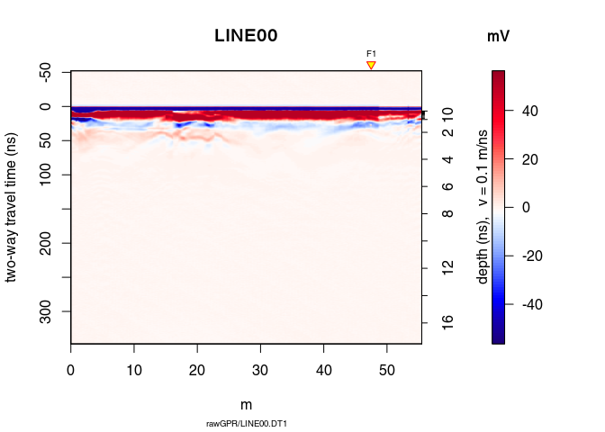

# RGPR tutorial - Basic GPR data processing
Emanuel Huber (emanuel.huber@alumni.ethz.ch)  
13 August 2017  


`RGPR` is a package for [R](https://cran.r-project.org/) to read, write, analyse and visualise ground-penetrating radar (GPR) data.

> R is a [free] programming language and software environment for statistical computing and graphics supported by the R Foundation for Statistical Computing ([Wikipedia > R](https://en.wikipedia.org/wiki/R_%28programming_language%29)).

**Note**: This R-package is still in development, and therefore some of the functions may change in a near future. The R-package `RGPR` is hosted on [GitHub](https://github.com/) at [https://github.com/emanuelhuber/RGPR](https://github.com/emanuelhuber/RGPR). You can contribute to the development of `RGPR`: create an account on [GitHub](https://github.com/), [fork](https://guides.github.com/activities/forking/) `RGPR`, improve it and sumbmit your modifications.

If you have any questions, comments or wishes, etc. feel free to contact me (in english, french or german)

> `emanuel.huber@alumni.ethz.ch`

# Objectives of this tutorial
* Learn some basics of ground-penetrating radar data processing with `RGPR`.
* Learn how to manipulate objects of the class `RGPR`.

Note that his tutorial will not explain you the math/algorithms behind the different processing methods.

In this tutorial the code snippets are in monospaced typewriter font like in the following example:

```r
1 + exp(1:10)
```

The R output are preceded by a double hash (`##`). The following R output is from the code snippet above.

```
##  [1]     3.718282     8.389056    21.085537    55.598150   149.413159
##  [6]   404.428793  1097.633158  2981.957987  8104.083928 22027.465795
```

Create a text file and save it with the `.R` extension (the extension for the R-script files). Then copy the code snippets into your R-script file and adapt them to your needs. To run the code in R, copy the code and paste it into the R console. You can also manually enter the code.

Don't hesitate to consult the help files and to search for help on the internet. For example, to see the help for the function `mean()`, enter:


```r
?mean    # open the help file related to the function mean()
```

# Preliminary

* Read the tutorial [RGPR - Getting started (tutorial 1)](http://emanuelhuber.github.io/RGPR/RGPR_tutorial_installation-load.html)
* Download the data [2014_04_25_frenke.zip](http://emanuelhuber.github.io/RGPR/2014_04_25_frenke.zip)

## File organisation
I recommand you to first think about the organisation of your files and directories. I suggest to organise them as follows:
```
/2014_04_25_frenke   (project directory with date and location)
    /processing      (here you will save the processed GPR files)
    /rawGPR          (the raw GPR data, never modify them!)
    RGPR_tutorial.R  (this is you R script for this tutorial)
```


## Install/load the necessary packages
Load the packages `RGPR` and `rChoiceDialogs` (`rChoiceDialogs` provides a collection of portable choice dialog widgets):

```r
library(RGPR)   # load RGPR in the current R session
library(rChoiceDialogs)
```

[optionally] If `RGPR` is not installed, follow the instructions of the tutorial "Getting started" to install it.

[optionally] If R answers you `there is no package called 'rChoiceDialogs'` you need first to install `rChoiceDialogs`, either through your R software or directly in R with:

```r
install.packages("rChoiceDialogs")
```

The warnings that R shows can be ignored.

## Set the working directory
The working directory must be correctly set to use relative filepath. The working directory can be set either in your R-software or in R directly with:

```r
myDir <- "/media/huber/Elements/UNIBAS/software/codeR/package_RGPR/RGPR-gh-pages/2014_04_25_frenke"
setwd(myDir)    # set the working directory
getwd()         # Return the current working directory (just to check)
```

```
## [1] "/media/huber/Elements/UNIBAS/software/codeR/package_RGPR/RGPR-gh-pages/2014_04_25_frenke"
```

[optionally] Alternatively, you can use an interactive dialog box from the R-package `rChoiceDialogs`:

```r
myDir <- rchoose.dir(default = "/home/huber/WORK/UNIBAS/RESEARCH/RGPR/")
setwd(myDir)    # set the working directory
getwd()         # Return the current working directory (just to check)
```

# Read GPR data
The raw GPR data are located in the directory `/rawGPR`. The data format is the Sensor & Softwares format. Each GPR data consists of 

* a header file (extension `.hd`) that can be opened with a normal text editor,
* and a binary data file (extension `.DT1`).

To read the Sensor & Softwares GPR data, enter


```r
A <- readGPR(fPath = "rawGPR/LINE00.DT1")   # the filepath is case sensitive!
```

If the filepath (argument `fPath`) is not correct compared with the working directory, an error message is thrown.

More information on the structure of an object of the class `RGPR` (like `A`) can be found in the tutorial "RGPR tutorial - `RGPR` class"

# Plot the GPR data
## 2D plot: radargramm
To plot the GPR record as a raster image (default mode), enter

```r
plot(A)                                 
```

<!-- -->

The yellow triangle indicates the position of a fiducial marker that was set 
during the survey to mark something (a specific object close to the GPR line, a 
change in morphology/topography/sedimentology, an intersection with another GPR 
line, etc.). These markers are very useful to add topographic data to the GPR 
profile, particularly when the fiducial markers correspond to the locations 
where the (x,y,z) coordinates were measured.


Plot wiggles

```r
plot(A, type = "wiggles")          
```

<!-- -->
Per default, the plot start at time-zero which is here set at approximately
52.1840028 s. To plot the full data, set the argument `relTime0` equal
to `FALSE` in the `plot()` function.

```r
plot(A, relTime0 = FALSE)
# add a red line at time-zero
abline(h = -mean(time0(A)), col = "green", lwd = 2)
```

<!-- -->

To plot only a part of the GPR data, use `xlim` and `ylim`. **Note that the 
y-axis is here inverse and you have to use negative values to plot something
below time-zero!**

```r
plot(A, ylim=c(-200, 0), xlim = c(30, 50))
```

<!-- -->


```r
plot(A, relTime0 = FALSE, ylim=c(-200, 0), xlim = c(30, 50))
# add a red line at time-zero
abline(h = -mean(time0(A)), col = "green", lwd = 2)
```

<!-- -->


Another way to plot only a part of the GPR data is to extract a part of the GPR
data. The object `A` can be manipulated in the same way as a matrix without 
losing the meta-data (see the tutorial [Description of the RGPR package (tutorial 4)](http://emanuelhuber.github.io/RGPR/RGPR_tutorial_RGPR-object.html)).

To extract the time samples 100 to 300 samples of the traces 15 to 150, simply
write this

```r
# extract the 100 to 300 samples of the traces 15 to 150
A0 <- A[100:300, 15:150]  
A
```

```
## *** Class GPR ***
##  name = LINE00
##  filepath = rawGPR/LINE00.DT1
##  1 fiducial(s)
##  description = 
##  survey date =  2014-04-25 
##  Reflection, 100MHz,Window length=399.6ns, dz=0.4ns
##  223 traces,55.5m long
##  ****************
```

```r
A0
```

```
## *** Class GPR ***
##  name = LINE00
##  filepath = rawGPR/LINE00.DT1
##  description = 
##  survey date =  2014-04-25 
##  Reflection, 100MHz,Window length=80ns, dz=0.4ns
##  136 traces,33.75m long
##  ****************
```

Check the depth/time and positions values

```r
depth(A)     
pos(A)
```

Plot a section/subset of the GPR record (like zooming)

```r
# plot the 100 to 300 samples of the traces 15 to 150
plot(A[100:300, 15:150])        
```

<!-- -->

## 1D plot: trace plot
Plot a signal trace, notice that the signal is clipped to \(+/-50\,mV\) 
(between \(0\) and \(20\,ns\)):

```r
plot(A[, 15])      # plot the 15th trace of the GPR-line   
```

<!-- -->

Note: the `@3.5m` in the plot title indicate the relative position of the trace
on the GPR profile.

Plot the first 40 trace samples:

```r
# plot the first 40 samples of the 15th trace of the GPR profile
plot(A[1:40, 15])  
```

<!-- -->

# Basic processing steps


## DC shift removal
Plot a single trace:

```r
plot(A[, 15])  # plot the 15th trace of the GPR-line
```

<!-- -->

Notice how the trace samples before the first wave arrival (before 
\(t = 0\,ns\)) are slightly shifted below \(0\,mV\)? This shift is called 
direct current offset (DC-offset) and you will remove it from the data. The 
direct current offset is estimated on trace samples before time-zero. 

1. Determine which samples will be used to estimate the direct current offset 
(i.e., the samples before the first wave arrival). Identify the samples before 
\(t = 0\,ns\) by ploting the first n samples of the traces. For example, for 
\(n = 110\):


```r
 # plot the first 110 samples of the 15th trace of the GPR profile
plot(A[1:110, 15]) 
```

<!-- -->

2. Remove the DC-offset estimated on the first n samples usind the function 
`dcshift()`. This function takes as argument the `GPR` object and the sample 
index used to estimate the DC shift (in this case, the first \(110\) samples):

```r
A1 <- dcshift(A, 1:110)   # new object A1 
```


You can visualise the DC-offset on the trace plot by adding an horizontal
lines (`abline(h=...)`) with the argument  `h` equal the DC-offset, i.e., the
mean of the first \(110\) samples (`mean(A[1:110,15]`):

```r
plot(A[, 15])  # plot the 15th trace of the GPR-line 
# add a green horizontal line
abline(h = mean(A[1:110, 15]), col = "green") 
```

<!-- -->


Have a look at A1:

```r
A1
```

```
## *** Class GPR ***
##  name = LINE00
##  filepath = rawGPR/LINE00.DT1
##  1 fiducial(s)
##  description = 
##  survey date =  2014-04-25 
##  Reflection, 100MHz,Window length=399.6ns, dz=0.4ns
##  223 traces,55.5m long
##  > PROCESSING
##    1. dcshift>u=1:110+FUN=mean
##  ****************
```

Compared with `A` or `print(A)`, two additional lines are displayed. The second 
line shows the applied processing step, `dcshift`, with the arguments passed to 
the function. 
Each time a GPR object is processed with a function, the name of the function 
as well as some of its arguments are stored in the GPR object. This enables to 
track the data processing, i.e., to know exactly which processing steps where 
applied to the data. This is a first step toward reproducible research.

The processing steps can be extracted with the function `processing()`:

```r
processing(A1)
```

```
## [1] "dcshift>u=1:110+FUN=mean"
```


## First wave break estimation and time-zero correction

The first wave break is estimated for each traces

```r
time0est <- firstBreak(A1)   # take some time
plot(pos(A1), time0est, pch = 20, ylab = "first wave break", 
     xlab = "position (m)")
```

<!-- -->

Check the first wave break on a trace plot

```r
plot(A1[, 15])  # plot the 15th trace of the GPR-line
abline( v = time0est[15] - time0(A1)[15], col = "green", lwd = 2)
```

<!-- -->

Here we define [time-zero] = [first wave break] - [air wave travel time between 
transmitter and receiver]. 
To shift the traces to time-zero, use the function `time0Cor` and set 
`keep = NULL` to account for the air wave travel time between transmitter and 
receiver.


```r
A2 <- time0Cor(A1, t0 = time0est, method = "pchip", keep = NULL)
```


Note that if `time0est` is too noisy, you can set `t0 = mean(time0est)`.


```r
plot(A2)
```

<!-- -->


## Dewow
Remove the low-frequency components (the so-called "wow") of the GPR record 
usind 

1. either a median absolute deviation (MAD) filter (`type = "MAD"`).
2. or a Gaussian filter (`type = "Gaussian"`). The Gaussian filter is faster 
than the MAD filter. 

In both cases, the argument `w` is the length of the filter in time units.

```r
A3 <- dewow(A2, type = "MAD", w = 50)     # dewowing: take some time
plot(A3)                                  # plot the result
```

<!-- -->

Can you see the difference with `A1`? Plot `A2 - A1` to see the removed "wow".

```r
plot(A3 - A2)                           # plot the difference
```

<!-- -->


See the dewowing by comparing the traces before (blue line) and after 
(red line):

```r
plot(A2[,15], col = "blue")      # before dewowing
lines(A3[,15], col = "red")      # after dewowing
```

<!-- -->

## Frequency filter

Let's have a look at the amplitude-frequency and phase-frequency plot 
(the spectrum given by the Fourier decomposition):

```r
spec(A3)
```

<!-- -->

The curve in red is the averaged amplitude/phase over all the trace 
amplitudes/phases.

On the first plot, notice 

* a sharp decrease of the amplitude between \(0\,MHz\) and \(10\,MHz\): these 
frequency correspond to the slowing-varying part of the signal. In this 
particular case, filtering out this part of the signal results in 
strong signal distorsion.
* after a peak at \(80\,MHz\) (the returned signal frequency that is lower than 
the antenna frequency because of frequency-dependent attenuation in the ground), 
the amplitude decreases.
* at about \(200\,MHz\) the amplitude stays constant (plateau): noise frequency.

Eliminate the high-frequency (noise) component of 
the GPR record with a bandpass filter. We define as corner frequencies 
at \(150\,MHz\) and \(260\,MHz\), and set 
`plotSpec = TRUE` to plot the spectrum with the signal, the filtered signal and 
the filter.

```r
A4 <- fFilter(A3, f = c(150, 260), type = "low", plotSpec = TRUE)
```

<!-- -->

```r
plot(A4)
```

<!-- -->

Let see the difference

```r
plot(A4 - A3, clip = 50)
```

<!-- -->

Ideally, the objective of processing is to remove the noise component without 
deterioring the signal component to improve the signal/noise ratio. When 
ploting the difference in processing (after - before), one should only observe 
the noise that is filtered out. However, in practice some part of the signal 
may be also deteriored when eliminating noise.

## Time gain
Apply a gain to compensate the signal attenuation. Three types of gain are 
disponible:

* power gain (`type = power`): \(A_g(t) = A(t)\cdot t^\alpha \) with 
\(\alpha = 1 \) per default.
* exponential gain (`type = exp`): \(A_g(t) = A(t)\cdot \exp(\alpha \cdot t)\).
* Automatic gain control (`type = agc`): make gain equal to the local root mean 
squared signal.

We will first apply a power gain and then an exponential gain.
To visualise the amplitude of the GPR signal as a function of time, use the 
function `plotAmpl()` as follows:

```r
plotAmpl(A4, col = "black")          # plot amplitude as a function of time
```

<!-- -->

On the previous plot, there is a sharp amplitude increase at about \(20\,ns\) 
corresponding to the first wave arrival. Then the amplitude decreases until a 
plateau at about \(200\,ns\). This plateau corresponds to the signal noise. 
There is little hope to extract some useful information above \(150\,ns\) 
because above \(150\,ns\) the signal/noise ratio is much smaller than \(1\) 
(i.e., more noise than signal).

### Power gain
The power gain is set constant until `tcst = 100` ns and applied from 
\(100\,ns\) to `te = 200` ns, with \(\alpha = 1\).

```r
A5 <- gain(A4, type = "power", alpha = 1, te = 150, tcst = 20)
```

Compare the amplitude before and after the power gain:

```r
plotAmpl(A5, col = "red")
# set add=TRUE to add the amplitude on the previous plot
plotAmpl(A4, col = "black", add = TRUE)   
```

<!-- -->

```r
plot(A5)        # how does it look after the gain?
```

<!-- -->


### Exponential gain

Ideally, the parameter \(\alpha\) in the exponential gain should be close to 
the slope of the amplitude decrease. This slope could be estimated by fitting 
a straight line to the amplitude decrease. We only want to apply the filter 
between \(0\,ns\) (`t0`) and \(125\,ns\) (`te` for \(t_{end}\)  ):

```r
A6 <- gain(A5, type ="exp",  alpha = 0.2, t0 = 0, te = 125)
plotAmpl(A6, col = "green")
```

<!-- -->

Oops! Set `alpha` to a smaller value!

```r
A6 <- gain(A5, type = "exp", alpha = 0.11, t0 = 0, te = 125)
plotAmpl(A6, col = "green")
plotAmpl(A5, col = "red", add = TRUE) 
plotAmpl(A4, col = "black", add = TRUE) 
```

<!-- -->

```r
plot(A6)    # how does it look after the gain?
```

<!-- -->

Plot the gained GPR record and clip the amplitude values to \(50\,mV\) using 
the argument `clip`:

```r
plot(A6, clip = 50)    # how does it look after the gain?
```

<!-- -->

## inverse normal transformations

Have a look at the histogram of the values of `A6`

```r
hist(A6[], breaks = 50)
```

<!-- -->

This histogram is very narrow, meaning that a lot of values are very close to 
zero and therefore many details are not really visible. To widen this 
histogram, we can transform it to make it more normally distributed with a
rank-based inverse normal transformation:


```r
A7 <- traceScaling(A6, type = "invNormal")
```

Histograms before and after


```r
par(mfrow = c(1, 2))
hist(A6[], breaks = 50)
hist(A7[], breaks = 50)
```

<!-- -->
Have a look at the results of the transformation:

```r
plot(A7)
```

<!-- -->

## Median filter (spatial filter)
A non-linear filter to remove noise:

```r
A8 <- filter2D(A7, type = "median3x3")
plot(A8)
```

<!-- -->

Let see the difference

```r
plot(A8 - A7)
```

<!-- -->

## Frequency-wavenumber filter (f-k-filter)

The function `spec()` with the argument `type = "f-k` returns a list containing 
the frequencies (f), the wavenumbers (k), the amplitude of the GPR data.


```r
FKSpec <- spec(A8, type = "f-k")
area <- list(x = c(0, min(FKSpec$wnb), min(FKSpec$wnb), max(FKSpec$wnb), max(FKSpec$wnb), 0),
             y = c(max(FKSpec$fre), 800, 0, 0, 800, max(FKSpec$fre) ))
lines(area, type="o")
```

<!-- -->

```r
A9 <- fkFilter(A8, fk = area)
```

With the f-k-filter you can successfully remove the artifacts but still 
the information gained is very small in this case (the quality of the
raw GPR data is already bad):

```r
plot(A9, clip = 50)
```

<!-- -->

```r
spec(A9, type = "f-k")
```

<!-- -->

<!---
By ploting the spectrum of the filtered GPR data you see that some 

```r
spec(A7, type = "f-k")
```

<!-- -->
-->

## Processing overview
Let review the processing step applied on the GPR record:

```r
processing(A9)
```

```
## [1] "dcshift>u=1:110+FUN=mean"                                                                                                                                                                                                                                                                                                                                                                                                                                                                                                                                                                                                                                                                                                                                                                                                                                                                                                                                                                                                                                                                                                                                                                  
## [2] "time0Cor//t0=49.2,49.2,49.2,49.2,49.2,49.2,49.2,49.2,49.2,49.2,49.2,49.2,49.2,48.8,48.8,48.8,49.2,49.2,49.2,49.2,49.2,49.2,49.2,49.2,49.2,49.2,49.2,49.2,49.6,49.6,49.6,49.6,49.6,49.6,49.6,49.6,49.6,49.6,49.6,49.6,49.2,49.6,49.6,49.6,49.6,49.6,49.6,49.6,49.6,49.2,49.2,49.2,49.6,49.2,49.2,49.2,49.2,49.6,49.6,49.6,49.6,49.6,49.6,49.6,49.6,47.6,47.6,47.2,47.2,47.2,47.6,47.6,47.6,47.6,49.2,47.6,47.6,47.6,49.2,48.8,48.8,49.2,48.8,48.8,49.2,49.2,49.6,49.2,49.6,49.6,49.6,49.2,49.2,49.2,49.2,49.2,49.2,49.6,49.6,49.2,49.6,49.6,49.2,49.2,49.2,49.2,49.2,49.2,49.2,49.2,49.2,49.6,49.6,49.6,49.6,49.2,49.2,49.2,49.2,49.2,49.2,49.6,49.6,49.2,49.2,49.6,49.6,49.6,49.6,49.6,49.2,49.2,49.2,49.2,49.2,49.2,49.2,49.2,49.2,49.2,49.2,49.2,49.2,49.2,49.2,49.2,49.2,49.2,49.2,49.2,49.2,49.2,49.2,49.6,49.6,49.6,49.6,49.6,49.6,49.6,49.6,49.6,49.6,49.6,49.6,49.6,49.6,49.6,49.6,49.6,49.6,49.6,49.6,49.6,49.6,49.6,49.6,49.2,49.6,49.6,49.2,49.6,49.6,49.6,49.6,49.2,49.2,49.2,49.6,49.2,49.2,49.6,49.6,49.2,49.2,49.2,50.8,50.8,50.8,50.8,50.8,50.8,50.4,50.8,50.8,50.8,50.8,50.8,50.8,50.8,50.8,50.8,50.8,50.8,49.2,50.4,50.4,50.4,50.4,50.4,50.4,50.4,50.4+method=pchip+keep="
## [3] "dewow//type=MAD+w=50"                                                                                                                                                                                                                                                                                                                                                                                                                                                                                                                                                                                                                                                                                                                                                                                                                                                                                                                                                                                                                                                                                                                                                                      
## [4] "fFilter//f=150,260+type=low+plotSpec=NULL"                                                                                                                                                                                                                                                                                                                                                                                                                                                                                                                                                                                                                                                                                                                                                                                                                                                                                                                                                                                                                                                                                                                                                 
## [5] "gain//type=power+alpha=1+te=150+tcst=20"                                                                                                                                                                                                                                                                                                                                                                                                                                                                                                                                                                                                                                                                                                                                                                                                                                                                                                                                                                                                                                                                                                                                                   
## [6] "gain//type=exp+alpha=0.11+t0=0+te=125"                                                                                                                                                                                                                                                                                                                                                                                                                                                                                                                                                                                                                                                                                                                                                                                                                                                                                                                                                                                                                                                                                                                                                     
## [7] "traceScaling//type=invNormal"                                                                                                                                                                                                                                                                                                                                                                                                                                                                                                                                                                                                                                                                                                                                                                                                                                                                                                                                                                                                                                                                                                                                                              
## [8] "filter2D//type=median3x3"                                                                                                                                                                                                                                                                                                                                                                                                                                                                                                                                                                                                                                                                                                                                                                                                                                                                                                                                                                                                                                                                                                                                                                  
## [9] "fkFilter//fk=0,-2,-2,2,2,0+fk=1250,800,0,0,800,1250"
```


## Save and export

Save the processed GPR record into the directory /processing. Use the `.rds` 
format (this is a R internal format)

```r
writeGPR(A9, fPath = file.path(getwd(), "processing", paste0(name(A9), ".rds")), 
         format = "rds", overwrite = TRUE)
```

```
## *** Class GPR ***
##  name = LINE00
##  filepath = /media/huber/Elements/UNIBAS/software/codeR/package_RGPR/RGPR-gh-pages/2014_04_25_frenke/processing/LINE00.dt1
##  1 fiducial(s)
##  description = 
##  survey date =  2014-04-25 
##  Reflection, 100MHz,Window length=352ns, dz=0.4ns
##  223 traces,55.5m long
##  > PROCESSING
##    1. dcshift>u=1:110+FUN=mean
##    2. time0Cor//t0=49.2,49.2,49.2,49.2,49.2,49.2,49.2,49.2,49.2,49.2,49.2,49.2,49.2,48.8,48.8,48.8,49.2,49.2,49.2,49.2,49.2,49.2,49.2,49.2,49.2,49.2,49.2,49.2,49.6,49.6,49.6,49.6,49.6,49.6,49.6,49.6,49.6,49.6,49.6,49.6,49.2,49.6,49.6,49.6,49.6,49.6,49.6,49.6,49.6,49.2,49.2,49.2,49.6,49.2,49.2,49.2,49.2,49.6,49.6,49.6,49.6,49.6,49.6,49.6,49.6,47.6,47.6,47.2,47.2,47.2,47.6,47.6,47.6,47.6,49.2,47.6,47.6,47.6,49.2,48.8,48.8,49.2,48.8,48.8,49.2,49.2,49.6,49.2,49.6,49.6,49.6,49.2,49.2,49.2,49.2,49.2,49.2,49.6,49.6,49.2,49.6,49.6,49.2,49.2,49.2,49.2,49.2,49.2,49.2,49.2,49.2,49.6,49.6,49.6,49.6,49.2,49.2,49.2,49.2,49.2,49.2,49.6,49.6,49.2,49.2,49.6,49.6,49.6,49.6,49.6,49.2,49.2,49.2,49.2,49.2,49.2,49.2,49.2,49.2,49.2,49.2,49.2,49.2,49.2,49.2,49.2,49.2,49.2,49.2,49.2,49.2,49.2,49.2,49.6,49.6,49.6,49.6,49.6,49.6,49.6,49.6,49.6,49.6,49.6,49.6,49.6,49.6,49.6,49.6,49.6,49.6,49.6,49.6,49.6,49.6,49.6,49.6,49.2,49.6,49.6,49.2,49.6,49.6,49.6,49.6,49.2,49.2,49.2,49.6,49.2,49.2,49.6,49.6,49.2,49.2,49.2,50.8,50.8,50.8,50.8,50.8,50.8,50.4,50.8,50.8,50.8,50.8,50.8,50.8,50.8,50.8,50.8,50.8,50.8,49.2,50.4,50.4,50.4,50.4,50.4,50.4,50.4,50.4+method=pchip+keep=
##    3. dewow//type=MAD+w=50
##    4. fFilter//f=150,260+type=low+plotSpec=NULL
##    5. gain//type=power+alpha=1+te=150+tcst=20
##    6. gain//type=exp+alpha=0.11+t0=0+te=125
##    7. traceScaling//type=invNormal
##    8. filter2D//type=median3x3
##    9. fkFilter//fk=0,-2,-2,2,2,0+fk=1250,800,0,0,800,1250
##  ****************
```
 
Export a high quality PDF: 

```r
exportPDF(A9, clip = 30, fPath = file.path(getwd(), "processing", name(A9)),
          lwd = 0.5, ws = 1.5)
```

## Read the saved GPR data

```r
procA <- readGPR(fPath = file.path(getwd(), "processing", paste0(name(A9), ".rds"))) 
```


# Some final thoughts
Warning: processing can 
introduce artifacts in the data and lead to false interpreations.

> What really matters is that the final interpretation is valid, 
and although processing is important, ultimately, the key to good data
interpretation is good data collection in the first place.   
*in Cassidy (2009) Chapter 5 - Ground Penetrating Radar Data Processing, 
Modelling and Analysis, In Ground Penetrating Radar Theory and Applications, 
(Eds Harry M. Jol,), Elsevier, Amsterdam, pp: 141-176, ISBN 9780444533487*.

> A good practical mantra for most users to adopt is if it cannot be
seen in the raw data – is it really there? As such, processing steps 
should be used to improve the raw-data quality, therefore, making 
interpretation easier. In practice, this means increasing the 
signal-to-noise ratio of coherent responses and presenting the data 
in a format that reflects the subsurface conditions accurately.   
*in Cassidy (2009) Chapter 5 - Ground Penetrating Radar Data Processing, 
Modelling and Analysis, In Ground Penetrating Radar Theory and Applications, 
(Eds Harry M. Jol,), Elsevier, Amsterdam, pp: 141-176, ISBN 9780444533487*.

> Processing of GPR data tends to improve the appearance of data, but rarely
does processing substantially change the interpretation.    
*in Daniels et al. (1997) Coincident Antenna Three-Dimensional GPR.
Journal of Environmental and Engineering Geophysics, Vol. 2, No.1, pp. 1–9*.


***

Notes

* This document was created with R-markdown and knitr.
