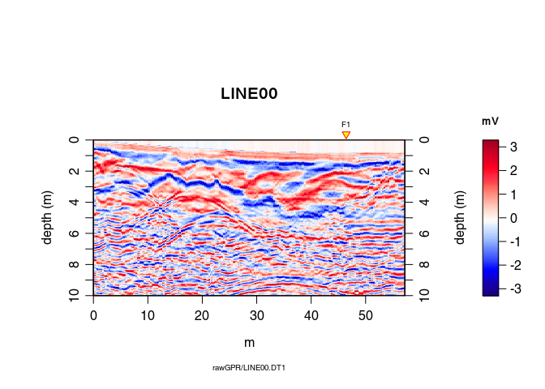

# RGPR tutorial - GPR data migration
Emanuel Huber (emanuel.huber@alumni.ethz.ch)  
14 August 2017  


`RGPR` is a package for [R](https://cran.r-project.org/) to read, write, analyse and visualise ground-penetrating radar (GPR) data.

> R is a [free] programming language and software environment for statistical computing and graphics supported by the R Foundation for Statistical Computing ([Wikipedia > R](https://en.wikipedia.org/wiki/R_%28programming_language%29)).

**Note**: This R-package is still in development, and therefore some of the functions may change in a near future. The R-package `RGPR` is hosted on [GitHub](https://github.com/) at [https://github.com/emanuelhuber/RGPR](https://github.com/emanuelhuber/RGPR). You can contribute to the development of `RGPR`: create an account on [GitHub](https://github.com/), [fork](https://guides.github.com/activities/forking/) `RGPR`, improve it and sumbmit your modifications.

If you have any questions, comments or wishes, etc. feel free to contact me (in english, french or german)

> `emanuel.huber@alumni.ethz.ch`

# Objectives of this tutorial
Learn how to migrate GPR data

Note that his tutorial will not explain you the math/algorithms behind the different processing methods.

In this tutorial the code snippets are in monospaced typewriter font like in the following example:

```r
1 + exp(1:10)
```

The R output are preceded by a double hash (`##`). The following R output is from the code snippet above.

```
##  [1]     3.718282     8.389056    21.085537    55.598150   149.413159
##  [6]   404.428793  1097.633158  2981.957987  8104.083928 22027.465795
```

Create a text file and save it with the `.R` extension (the extension for the R-script files). Then copy the code snippets into your R-script file and adapt them to your needs. To run the code in R, copy the code and paste it into the R console. You can also manually enter the code.

Don't hesitate to consult the help files and to search for help on the internet. For example, to see the help for the function `mean()`, enter:


```r
?mean    # open the help file related to the function mean()
```

# Preliminary

* Read the tutorial [RGPR - Getting started (tutorial 1)](http://emanuelhuber.github.io/RGPR/RGPR_tutorial_installation-load.html)
* Read the tutorial [Basic GPR data processing (tutorial 2)](http://emanuelhuber.github.io/RGPR/RGPR_tutorial_basic-processing.html)
* Read the tutorial [Add coordinates to the GPR data (tutorial 3)](http://emanuelhuber.github.io/RGPR/RGPR_tutorial_RGPR-survey.html)
* Download the data [2014_04_25_frenke.zip](http://emanuelhuber.github.io/RGPR/2014_04_25_frenke.zip)

## File organisation
I recommand you to first think about the organisation of your files and directories. I suggest to organise them as follows:
```
/2014_04_25_frenke   (project directory with date and location)
    /processing      (here you will save the processed GPR files)
    /rawGPR          (the raw GPR data, never modify them!)
    RGPR_tutorial.R  (this is you R script for this tutorial)
```


## Install/load the necessary packages and et the working directory
Load the packages `RGPR` and `rChoiceDialogs` (`rChoiceDialogs` provides a collection of portable choice dialog widgets):

```r
library(devtools)
devtools::install_github("emanuelhuber/RGPR")
library(RGPR)   # load RGPR in the current R session
library(rChoiceDialogs)
myDir <- "/media/huber/Elements/UNIBAS/software/codeR/package_RGPR/RGPR-gh-pages/2014_04_25_frenke"
setwd(myDir)    # set the working directory
getwd()         # Return the current working directory (just to check)
```

```
## [1] "/media/huber/Elements/UNIBAS/software/codeR/package_RGPR/RGPR-gh-pages/2014_04_25_frenke"
```


# Read GPR data


```r
A <- readGPR(fPath = "rawGPR/LINE00.DT1")   # the filepath is case sensitive!
```


# Pre-processing

## Add topographic data (coordinates)
We assume that for each GPR record there is a file containing the (x, y, z) 
coordinates of every traces. The header of these files is "E", "N", "Z" 
instead of "x", "y", "z" because in topography "x" sometimes designates the 
North ("N") and not the East ("E") as we would expect. The designation
"E", "N", "Z" is less prone to confusion and therefore we chose it!

1. Define the filepaths to the topo files:

```r
TOPO <- file.path(getwd(), "coord/topo/LINE00.txt")
```

2. Read all the files with the funciton `readTopo()` that creates a list whose 
elements correspond to the GPR record and contain all the trace coordinates:

```r
TOPOList <- readTopo(TOPO, sep = "\t")
```

3. Set the list of coordinates as the new coordinates to the GPRsurvey object:

```r
coord(A) <- TOPOList[[1]]
```


## DC shift removal
Remove the DC-offset estimated on the first n samples usind the function 
`dcshift()`. This function takes as argument the `GPR` object and the sample 
index used to estimate the DC shift (in this case, the first \(110\) samples):

```r
A1 <- dcshift(A, 1:110)   # new object A1 
```


## First wave break estimation and set time-zero

The first wave break is estimated for each traces

```r
tfb <- firstBreak(A1)   # take some time
```

Convert the first wave break time into time-zero with `firstBreakToTime0()`. Here we define [time-zero] = [first wave break] - [air wave travel time between 
transmitter and receiver]. 

```r
t0 <- firstBreakToTime0(tfb, A1)
time0(A1) <- t0     # set time0 to A1
```

To shift the traces to time-zero, use the function `time0Cor`.


```r
A2 <- time0Cor(A1, method = "spline")
```


## Dewow
Remove the low-frequency components (the so-called "wow") of the GPR record 
with:


```r
A3 <- dewow(A2, type = "MAD", w = 50)     # dewowing: take some time
```

## Frequency filter

Eliminate the high-frequency (noise) component of 
the GPR record with a bandpass filter. We define as corner frequencies 
at \(150\,MHz\) and \(260\,MHz\), and set 
`plotSpec = TRUE` to plot the spectrum with the signal, the filtered signal and 
the filter.


```r
A4 <- fFilter(A3, f = c(150, 260), type = "low", plotSpec = TRUE)
```

<!-- -->


## Time gain
Apply a power gain and a spherical gain to compensate for geometric wave 
spreading and attenuation (Kruse and Jol, 2003; Grimm et al., 2006).


```r
A5 <- gain(A4, type = "power", alpha = 1, te = 150, tcst = 20)
A6 <- gain(A5, type = "exp", alpha = 0.11, t0 = 0, te = 125)
```

## Constant offset correction
Time correction for each trace to compensate the offset between transmitter 
and receiver antennae (it converts the trace time of the data acquired with
a bistatic antenna system into trace time data virtually acquiered with 
a monostatic system)


```r
A7 <- timeCorOffset(A6)
plot(A7)
```

<!-- -->


# Topographic Kirchhoff migration
See Dujardin & Bano (2013, Topographic migration of GPR data: 
Examples from Chad and Mongolia, Comptes Rendus Géoscience, 345(2):73-80.
Doi : 10.1016/j.crte.2013.01.003)

Time upsampling (sinc-interpolation) of the GPR data to reduce the aliasing risk.

```r
A8 <- upsample(A7, n = c(3,1))
```


Topographic Kirchhoff migration.

Vertical resolution of the migrated data: `dz = 0.01`m.

Dominant frequency: `fdo = 80` MHz (used to estimate the Fresnel zone)


```r
A9 <- migration(A8, type="kirchhoff", max_depth = 10, 
                 dz = 0.01, fdo = 80)
plot(A9)
```

<!-- -->

You don't see so much: we need some post-processing!

# Post-processing

Trace smoothing with a Gaussian filter

```r
A10 <- filter1D(A9, type="Gaussian", sigma=2.5) 
```

Automatic gain control

```r
A11 <- gain(A10, type="agc", w=0.55) 
```

inverse normal transformations

```r
A12 <- traceScaling(A11, type = "invNormal")
```


# Comparison before/after migration

Before migration

```r
plot(traceScaling(A8, type = "invNormal"))
```

<!-- -->

After migration


```r
plot(A12)
```

<!-- -->


***

Notes

* This document was created with R-markdown and knitr.
