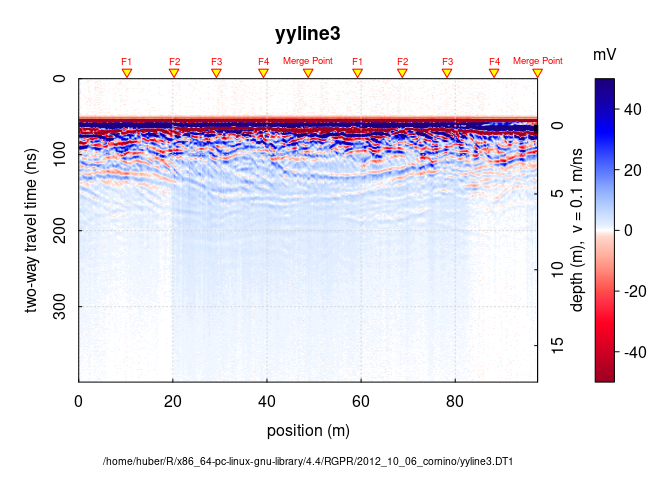
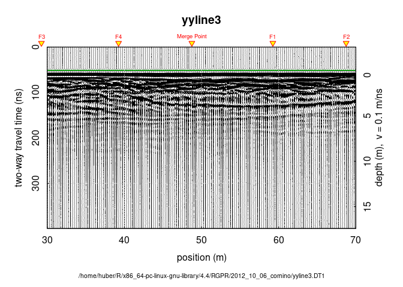

=================
Tutorial plot GPR
=================

Load RGPR
=========

.. container:: cell

   .. code:: r

      library(RGPR)

   .. container:: cell-output cell-output-stderr

      ::

         Don't hesitate to contact me if you have any question:
         emanuel.huber@pm.me

   .. container:: cell-output cell-output-stderr

      ::

         Attaching package: 'RGPR'

   .. container:: cell-output cell-output-stderr

      ::

         The following object is masked from 'package:base':

             intersect

Default plot
============

.. container:: cell

   .. code:: r

      dsn0 <- c(system.file("2012_10_06_cornino", "yyline3.DT1", package="RGPR"),
                system.file("2012_10_06_cornino", "yyline3.HD", package="RGPR"))
      x <- readGPR(dsn0[1])
      plot(x)

   .. container:: cell-output-display

      |image1|

You can tweak many things, among others:

-  **Plot type** By setting ``type`` equal to either ``raster``,
   ``wiggles`` (see `Figure 2 <#fig-plot-GPR-wiggles>`__) or ``contour``
-  **Time-zero line** The green line indicates the position of
   time-zero.
-  **Fiducial markers** The yellow triangle indicates the position of a
   fiducial marker that was set during the survey to mark something
   (such as a specific object close to the GPR line, a change in
   morphology/topography/sedimentology or an intersection with another
   GPR line). These markers are very useful to add topographic data to
   the GPR profile, particularly when the fiducial markers correspond to
   the locations where the (x,y,z) coordinates were measured.
-  **Labels** like axis labels (``xlab``, ``ylab``), title (``main``),
-  **Colorbar**
-  **Export as PDF or PNG** By setting ``export = file_path.png``.

.. container:: cell

   .. code:: r

      plot(x, type = "wiggles", wiggles = list(size = 0.02, side = 1), xlim = c(30, 70))

   .. container:: cell-output-display

      |image2|

Running Code
============

When you click the **Render** button a document will be generated that
includes both content and the output of embedded code. You can embed
code like this:

.. container:: cell

   .. code:: r

      1 + 1

   .. container:: cell-output cell-output-stdout

      ::

         [1] 2

You can add options to executable code like this

.. container:: cell

   .. container:: cell-output cell-output-stdout

      ::

         [1] 4

The ``echo: false`` option disables the printing of code (only output is
displayed).

